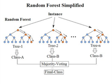

```{r setup, include=FALSE}
knitr::opts_chunk$set(echo = TRUE)
library(tidyverse)
library(tree)
library(randomForest)
library(plotly)
```

# Drzewa decyzyjne, Random Forest, Gradient Boosting

## Drzewa decyzyjne

Zacznijmy od prostego problemu modelowania. Ponizsze dane zawierają informacje o baseball'istach - jak długo grają, współczynnik uderzen oraz zarobki. Przypuśćmy, ze interesuje nas zamodelowanie zarobków pozostałymi cechami:

```{r, message=FALSE}
baseball <- read_csv("baseball.csv")

ggplot(baseball, aes(Years, Hits, color = Salary)) + geom_point(size = 2) +
  theme_bw() + scale_colour_gradient(low = "blue", high = "red")
```

Naszym pierwszym pomysłem mógłby być model regresji liniowej (GLM). Zauważmy jednak, że dopasowanie nie będzie najlepsze (spójrz np. na R^2):

```{r}
baseball_reg_lin <- lm(Salary ~ Years + Hits, data = baseball)
summary(baseball_reg_lin)
```

Wizualizacja w 3 wymiarach pozwoli nam dostrzec problem:

```{r, message=FALSE, warning=FALSE}
data3d_lin <- expand.grid(seq(0, 10, by = 0.1), seq(0, 30, by = 0.1)) %>%
  dplyr::rename(Years = Var1, Hits = Var2) %>%
  bind_cols(., Salary = predict(baseball_reg_lin, .)) %>%
  mutate(col = "Predicted") %>%
  bind_rows(., baseball %>% mutate(col = "Real"))

plot_ly(data = data3d_lin, x = ~Years, y = ~Hits, z = ~Salary,
        size = I(4), color = ~col, colors = c("green", "red"))
```

Okazuje się, ze w przypadku baseball'istów zarobki nie rosną liniowo, zawodnik moze liczyć za wysokoą podwyzke dopiero po "przepracowaniu" około 5 lat pod warunkiem, że osiąga bardzo dobre wyniki.

Nie są tu spełnione założenia modelu liniowego, stąd **underfitting** widoczny w modelu regresji liniowej (nasz model jest za mało elastyczny w tej sytuacji). W opisanym tutaj przypadku dobrą alternatywą mogą okazać się modele z rodziny **drzew decyzyjnych**.

**CART** jest jednym z algorytmów (inne to np. C4.5, C5.0, ID3) budowy drzew decyzyjnych w celu klasyfikacji lub regresji. Celem budowy drzewa jest **podział przestrzeni na prostokątne obszary** tak, aby zminimalizować pewien z góry ustalony błąd (funkcję straty) np. błąd średnio-kwadratowy (MSE). Obszary te nazywamy **liśćmi**, a punkty w których dokonujemy podziału **wierzchołkami drzewa**. Predykcja w każdym liściu to zwykła średnia wartości zmiennej objaśnianej w przypadku regresji lub modalna w przypadku klasyfikacji.

Algorytm dokonuje jednego podziału w każdym kroku i robi to **zachłannie**.

Predykcja jest szybka i łatwa w interpretacji, jednakże wynik jest **obciążony dużą wariancją** (mała zmiana w danych / outlier może znacząco wpłynąć na wynik), dlatego też CART stosowany jest często w **Ensemblerach**.

Wizualizacja poszukiwania odpowiedniego podziału w CART wygląda następująco:


Zacznijmy od budowy prostego drzewa decyzyjnego:

```{r}
cart_model <- tree(Salary ~ Years + Hits, data = baseball)
cart_model

ggplot(baseball, aes(Years, Hits, color = Salary)) + geom_point(size = 2) +
  theme_bw() + scale_colour_gradient(low = "blue", high = "red") + geom_vline(xintercept = 4.994818) +
  geom_segment(x = 4.994818, y = 19.80246, xend = 11, yend = 19.80246, color = "black") +
  geom_label(x = 2.5, y = 15, label = 5004.361, size = 5, color = "black") +
  geom_label(x = 7.5, y = 10, label = 5958.047, size = 5, color = "black") +
  geom_label(x = 7.5, y = 25, label = 10085.784, size = 5, color = "black")
```

Wizualizacja w 3 wymiarach pomoże sprawdzić czy model jest lepiej dopasowany:

```{r, message=FALSE, warning=FALSE}
data3d <- expand.grid(seq(0, 10, by = 0.1), seq(0, 30, by = 0.1)) %>%
  dplyr::rename(Years = Var1, Hits = Var2) %>%
  bind_cols(., Salary = predict(cart_model, .)) %>%
  mutate(col = "Predicted") %>%
  bind_rows(., baseball %>% mutate(col = "Real"))

plot_ly(data = data3d, x = ~Years, y = ~Hits, z = ~Salary,
        size = I(4), color = ~col, colors = c("green", "red"))
```

Oczywiście pojawia się nastepujace pytanie: kiedy powinno się przerwać podział naszej przestrzeni na kolejne liście ? Sprawdźmy model z większą ilością liści:

```{r, message=FALSE, warning=FALSE}
cart_model2 <- tree(Salary ~ Years + Hits,
                   data = baseball,
                   mindev = 0.001)
cart_model2

data3d2 <- expand.grid(seq(0, 10, by = 0.1), seq(0, 30, by = 0.1)) %>%
  dplyr::rename(Years = Var1, Hits = Var2) %>%
  bind_cols(., Salary = predict(cart_model2, .)) %>%
  mutate(col = "Predicted") %>%
  bind_rows(., baseball %>% mutate(col = "Real"))

plot_ly(data = data3d2, x = ~Years, y = ~Hits, z = ~Salary,
        size = I(4), color = ~col, colors = c("green", "red"))
```

Istnieje kilka możliwości odpowiedzi na to pytanie:

 - możemy zaprzestać podziału po ustalonej z góry liczbie podziałów
 - możemy ustalić minimalną liczbę obserwacji w liściu (nie mniej niż N)
 - możemy zaprzestać podziału jeśli MSE (lub inna wybrana przez nas wartość funkcji straty) nie zmniejszy się istotnie dzieki podziałowi - podział nie daje nam lepszej predykcji
 
W powyzszym przykładzie estymator w każdym liściu był po prostu średnią ze wszystkich punktów w danym liściu. Nie musi tak jednak być, moglibyśmy na przykład w każdym liściu uzyć regresji liniowej albo innego alrogytmu.

## Ensemblers

Drzewa decyzyjne są tak zwanymi **słabymi modelami** (weak learners). Oznacza to, ze są podatne na underfitting/overfitting (ich predykcje sa lepsze od rzutu moneta, ale ledwo)..

Jednym z rozwiązan tego problemu jest użycie bardziej elastycznego modelu jak np. sieć neuronowa. To co możemy jednak zrobić to zbudować tak zwany **ensembler**, w którym łączymy ze sobą kilka słabych modeli, aby otrzymać jeden **mocny model** (strong learner).

Najpopularniejsze metody tworzenia ensemblerów to:

1. **Metody niehybrydowe** – korzystają z jednego rodzaju algorytmu:
   a) **Bootstrap agregation (bagging)**
       - **Random Forest** jako specjalny przypadek
   b) **Boosting**
       - **Gradient Boosting**
       - AdaBoost
       - BrownBoost
       - CoBoosting
       - **XGBoost**
2. **Metody hybrydowe** – korzystają z kilku rodzajów algorytmów
    a) **Stacking (stacked generalization)**
    b) Cascading
    c) Mixture of Experts
 
## Bagging

**Bagging** to metoda, w której kolejne modele liczone są **równolegle** na **próbkach bootstrapowych**. Końcowy wynik jest uśrednieniem (lub modalną) wszystkich modeli. Bagging nie zmienia biasu, jednakże znacznie redykuje wariancje rozwiązania, dlatego też do baggingu jako weak learners nalezy używać modele o stosunkowo wysokiej wariancji.

$$
Bias_{bagging} = Bias_{weak\ learner}\\
Variance_{bagging} = \frac{Variance_{weak\ learner}}{K-1}
$$

**Random Forest** jest szczególnym przypadkiem baggingu, w którym

1. Słabymi algorytmami są drzewa klasyfikacyjne / regresyjne

2. W każdym podziale drzewa (na kolejne liście) wybierana jest losowo część zmiennych (nie sprawdzamy wszystkich możliwych podziałów, tylko te losowo wybrane). Procedura ta zmniejsza korelacje pomiędzy drzewami.



```{r, message=FALSE, warning=FALSE}
## Bagging (bootstrap aggregating)
bootstrap_datas <- 1:100 %>% map(~ sample(1:nrow(baseball), nrow(baseball), TRUE) %>%
              baseball[., ])
bootstrap_trees <- bootstrap_datas %>% map(~ tree(Salary ~ Years + Hits,
                             data = .x))
bootstrap_trees2 <- bootstrap_datas %>% map(~ tree(Salary ~ Years + Hits,
                                                  data = .x,
                                                  mindev = 0.001))
grid <- expand.grid(seq(0, 10, by = 0.1), seq(0, 30, by = 0.1)) %>%
  dplyr::rename(Years = Var1, Hits = Var2)
bagging_predictions <- bind_cols(grid, Salary = map(bootstrap_trees , ~ predict(.x, grid)) %>%
              do.call(cbind, .) %>% apply(., 1, mean)) %>%
  mutate(col = "Predicted") %>%
  bind_rows(., baseball %>% mutate(col = "Real"))
bagging_predictions2 <- bind_cols(grid, Salary = map(bootstrap_trees2 , ~ predict(.x, grid)) %>%
                                   do.call(cbind, .) %>% apply(., 1, mean)) %>%
  mutate(col = "Predicted") %>%
  bind_rows(., baseball %>% mutate(col = "Real"))

plot_ly(data = bagging_predictions, x = ~Years, y = ~Hits, z = ~Salary,
        size = I(4), color = ~col, colors = c("green", "red"))  

plot_ly(data = bagging_predictions2, x = ~Years, y = ~Hits, z = ~Salary,
        size = I(4), color = ~col, colors = c("green", "red"))
## Random Forests
rf_model <- randomForest(Salary ~ Years + Hits,
                   data = baseball,
                   importance = TRUE,
                   ntree = 10)

rf_model2 <- randomForest(Salary ~ Years + Hits,
                         data = baseball,
                         importance = TRUE,
                         ntree = 100)

data3drf <- expand.grid(seq(0, 10, by = 0.1), seq(0, 30, by = 0.1)) %>%
  dplyr::rename(Years = Var1, Hits = Var2) %>%
  bind_cols(., Salary = predict(rf_model, .)) %>%
  mutate(col = "Predicted") %>%
  bind_rows(., baseball %>% mutate(col = "Real"))
data3drf2 <- expand.grid(seq(0, 10, by = 0.1), seq(0, 30, by = 0.1)) %>%
  dplyr::rename(Years = Var1, Hits = Var2) %>%
  bind_cols(., Salary = predict(rf_model2, .)) %>%
  mutate(col = "Predicted") %>%
  bind_rows(., baseball %>% mutate(col = "Real"))

plot_ly(data = data3drf, x = ~Years, y = ~Hits, z = ~Salary,
        size = I(4), color = ~col, colors = c("green", "red"))

plot_ly(data = data3drf2, x = ~Years, y = ~Hits, z = ~Salary,
        size = I(4), color = ~col, colors = c("green", "red"))
```

## Boosting

**Boosting** to zbiór metod, w której kolejne modele liczone są **sekwencyjnie**. Zadaniem boostingu jest zmniejszenie biasu jak i wariancji modelu.

Zastanówmy się nad poniższą procedurą:

1. Wybierzmy algorytm $A$ i obliczmy predykcje $f(x)$ dla naszego zbioru
2. Obliczmy reszty modelu $y-f(x)$
3. Zastosujmy algorytm $A$ dla danych $(x, y-f(x))$ otrzymując predykcje $g(x)$
4. Do predykcji $f(x)$ dodajmy $g(x)$ otrzymując w ten sposób lepsze dopasowanie.
5. Jeśli dopasowanie nadal nie jest zadowalające możemy to powtórzyć...

Opisany przykład to przypadek **Gradient boostingu**.

W ogólnym przypadku gradient boostingu zamiast reszt modelu obliczamy **gradient funkcji straty po $f(x)$**. W przypadku gdy funkcją straty jest MSE gradienty są równe resztom. Występuje także stała $learning rate$, która mówi jak bardzo uwzględniamy kolejne predyckje:

$$
F(x) = f(x) + \sum_{k=1}^{K} LR^{a(k)} g_k(x)
$$


## Stacking

Stacking jest metodą pozwalającą na połączenie rożnych algorytmów.

Przebiega on dwuetapowo. W pierwszym etapie stosujemy każdy algorytm na zbiorze treningowym. Następnie dla każdego algorytmu liczymy predykcje dla zbioru treningowego. Predykcje te (ze wszystkich modeli) posłużą jako predyktory w modelu w drugim etapie. 

