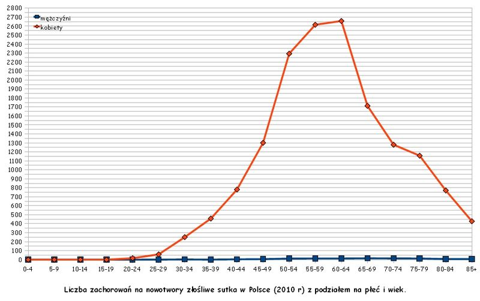
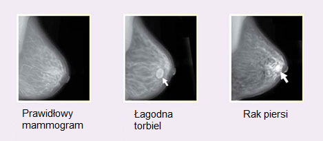

```{r setup, include=FALSE}
knitr::opts_chunk$set(echo = TRUE)
library(tidyverse)
library(corrplot)
library(mctest)
library(caret)
library(pROC)
```

# Regresja logistyczna

## Przedstawienie problemu

Jak możemy przeczytać na [Wikipedii](https://pl.wikipedia.org/wiki/Rak_sutka), rak piersi który jest potoczną nazwą nowotworu sutka, jest najczęstszym nowotworem złośliwym gruczołu sutkowego wywodzący się z tkanki nabłonkowej. Na świecie rak ten jest najczęściej występującym nowotworem złośliwym u kobiet. Rak sutka pojawia się także u mężczyzn, jednak jest rzadki i zwykle późno rozpoznawany.

Jeśli weźmiemy pod uwagę czynniki ryzyka można wyróżnić:

 - Płeć (99% raków sutka występuje u kobiet)
 - Czynniki geograficzne (Do obszarów, w których ryzyko raka piersi jest większe, należą Ameryka Północna i północna Europa, rzadziej występuje on w Azji i Afryce)
 - Czynniki genetyczne
 - Wiek (Ryzyko wystąpienia raka piersi wzrasta z wiekiem począwszy od 30 roku życia)
 - Przebieg miesiączkowania
 - I wiele innych związanych z innymi schorzeniami 



Rak sutka jest wykrywany zwykle jako macalne, niebolesne zgrubienie w piersi. Obecnie przesiewowe badania mammograficzne pozwalają na wykrycie raka zanim stanie się on dostępny badaniu palpacyjnemu. Inne objawy zwykle pojawiają się gdy guz jest już wyczuwalny, wczesnym objawem może być zaciągnięcie brodawki sutkowej, tzw. pępek rakowy. Zajęcie dróg chłonnych może być przyczyną miejscowego obrzęku limfatycznego, czego wyrazem jest tzw. objaw skórki pomarańczowej.

Metody dzięki którym lekarze mogą rozpoznać rozwój raka sutka możemy podzielić m.in na:

 - metody mammograficzne
 - ultrasonografia
 - palpacja
 - oraz wiele innych metod wspomagających
 


Leczenie raka piersi jest procesem wieloetapowym. Prowadzone powinno być przez zespół w składzie lekarskim składającym się m.in z chirurga onkologicznego, onkologa klinicznego, onkologa radioterapeuty, rehabilitanta oraz psychologa klinicznego.Takowy zespól ocenia kliniczny stopień zaawansowania rozwoju nowotworu. W zależności od niego wybierane jest postępowanie pierwotne–operacyjne, leczenie przedoperacyjne czy też leczenie paliatywne. Po ewentualnej operacji oceniany jest patologiczny stopień zaawansowania nowotworu, typ histologiczny raka oraz występowanie ważnych klinicznie receptorów – estrogenowych, progesteronowych, nadekspresji receptora dla nabłonkowego czynnika wzrostu (HER2).

Po zabiegu operacyjnym następuje ocena histopatologiczna usuniętego preparatu. W zależności od patologicznego stopnia zaawansowania oraz stanu pacjenta wybierana jest strategia leczenia uzupełniającego. Leczenie to możemy podzielić na różne typy:

 - radioterapia
 - chemoterapia
 - terapia celowana
 - hormonoterapia

Wykrycie rozwoju nowotworu sutka w odpowiednio wczesnym etapie rozwoju może mieć ogromny wpływ na zahamowanie nie tylko przerzutów, ale również dalszego rozwoju. Jednym z wielu sposobów profilaktycznych może być ocena pacjenta pod względem określonych cech w celu oszacowania prawdopodobieństwa obecności choroby. Biorąc ten fakt pod uwagę oraz ogromny rozwój metod uczenia maszynowego, na podstawie odpowiednich i reprezentatywnych danych stworzenie algorytmu, będącego w stanie ocenić prawdopodobieństwo obecności nowotworu u pacjenta może być pomocny zarówno dla lekarzy oraz dla pacjenta.

Naszym zadaniem będzie klasyfikacja raka sutka ze względu na tym łagodny z złośliwy.

```{r, message=FALSE}
wdbc <- read_csv("wdbc.csv")
```

Orginanly opis zmiennych:

1) ID number
2) Diagnosis (M = malignant, B = benign)
3-32) Ten real-valued features are computed for each cell nucleus:

a) radius (mean of distances from center to points on the perimeter)
b) texture (standard deviation of gray-scale values)
c) perimeter
d) area
e) smoothness (local variation in radius lengths)
f) compactness (perimeter^2 / area - 1.0)
g) concavity (severity of concave portions of the contour)
h) concave points (number of concave portions of the contour)
i) symmetry
j) fractal dimension ("coastline approximation" - 1)

The mean, standard error and "worst" or largest (mean of the three
largest values) of these features were computed for each image,
resulting in 30 features. For instance, field 3 is Mean Radius, field
13 is Radius SE, field 23 is Worst Radius.

## Model regresji logistycznej

Badana przez nas zmienna $Diagnosis$ przyjmuje dwie wartości kategoryczne, czyli mamy do czynienia z rozkładem Bernulliego, który należy do **rodziny rozkładów wykładnicznych z nadmierną dyspersją** (OEF - overdispersed exponential family). Zdefiniujmy więc model **regresji logistycznej** będący modelem klasy GLM:

$$
y|X \sim \operatorname{Bernoulli}(p) \\
logit(\mu)= logit(p)=\ln (\frac{p}{1-p})=X\beta
$$
Odwracając funkcje **logit** dostaniemy wzór na prawdopoddobieństwo $p$ zadane funkcją **sigmoid**:

$$
p = sigmoid(X\beta) = \frac{1}{1+e^{-X\beta}}
$$

```{r, warning=FALSE}
logit <- function(y) log(y / (1 - y))
sigmoid <- function(x) 1 / (1 + exp(-x))
data <- tibble(x = seq(-10, 10, by = 0.1),
               s = sigmoid(x),
               y = seq(0, 1, by = 0.005),
               l = logit(y))
ggplot(data, aes(y, l)) + theme_bw() + geom_line() + ggtitle("Logit function")
ggplot(data, aes(x, s)) + theme_bw() + geom_line() + ggtitle("Sigmoid function")
```

Funkcję masy prawdopodobieństwa dla rozkładu Bernulliego możma zapisać jako:

$$
\begin{array}{c}
f_p(y)=p^{y}(1-p)^{1-y}=\exp \left(\ln \left(p^{y}(1-p)^{1-y}\right)\right)=\exp \left(\ln \left(p^{y}\right)+\ln (1-p)^{1-y}\right)= \\
\exp (y \ln (p)+(1-y) \ln (1-p))=\exp \left(y \ln \frac{p}{1-p}+\ln (1-p)\right)
\end{array}
$$

gdzie:

$$
\begin{array}{c}
\theta=\ln \left(\frac{p}{1-p}\right)=\log i t(p)=\eta, \quad p=\frac{e^{\theta}}{1+e^{\theta}}, \quad \phi=a(\phi)=1, \\
b(\theta)=\ln \left(1+e^{\theta}\right), \quad b^{\prime}(\theta)=\frac{e^{\theta}}{1+e^{\theta}}=p=\mu, \\
b^{\prime \prime}(\theta)=\frac{e^{\theta}}{1+e^{\theta}}-\left(\frac{e^{\theta}}{1+e^{\theta}}\right)^{2}, \quad V(\mu)=\mu(1-\mu)
\end{array}
$$

co udowadnia, że rozkład ten należy do OEF.

Zdefiniujmy teraz log-likelihood:

$$
\ell(\beta \mid y)=\sum_{i=1}^{n}(y_{i} \ln(p)+(1-y_{i}) \ln(1-p))=\sum_{i=1}^{n}-\ln (1+e^{X_{i *} \beta})+\sum_{i=1}^{n} y_{i}(X_{i *} \beta).
$$
Aby obliczyć wartości parametrów $\beta$ należałoby rozwiązać równania wiarygodności:

$$
\frac{\partial \ell}{\partial \beta_{j}}=\sum_{i=1}^{n} x_{i j}\left(y_{i}-\frac{1}{1+e^{-\left(x_{i j} \beta_{j}\right)}}\right)=0
$$
Niestety w tym jak i w wielu innych przypadkach nie da się jawnie okreslic rozwiazania. Mozna je za to znaleźć iteracyjnie korzystając np z algorytmu **spadku wzdłuż gradientów** lub algorytmu **Newtona-Raphsona**:

$$
\beta^{(k+1)}=\beta^{(k)}-\frac{u\left(\beta^{(k)}\right)}{\mathscr{H}\left(\beta^{(k)}\right)}
$$

gdzie $u\left(\beta^{(k)}\right)$ oznacza gradient, a $\mathscr{H}\left(\beta^{(k)}\right)$ Hessian log-likelihood.

## Eksploracyjna analiza danych

Usuniemy zmienna $ID_number$ jako że nie wnosi ona informacji do modelu

```{r}
wdbc <- wdbc %>% select(-ID_number)
```

Sprawdźmy teraz czy w naszych danych znajdują się jakies braki

```{r}
colSums(is.na(wdbc))
```

Przy klasyfikacji jednym z najwazniejszych pytań podczas eksploracyjnej analizy danych jest **zbalansowanie** zmiennej zaleznej a raczej jego brak. W przypadku niezbalansowanych danych dużo trudniej jest zbudować dobrze działający klasyfikator.

```{r}
table(wdbc$Diagnosis)
ggplot(wdbc, aes(x = Diagnosis, fill = Diagnosis)) + geom_bar() + theme_bw()
```

Kolejnym krokiem jest zbadanie rozkładów predyktorów.

```{r}
for (col in colnames(wdbc)[2:31]) {
  plot(ggplot(wdbc, aes_string(x = col, fill = "Diagnosis")) + theme_bw() + geom_histogram(bins = 35) + ggtitle(paste("Histogram dla zmiennej", col)))
}
```

Jak widać niektóre zmienne mają do siebie bardzo podobne rozkłady nalezy więc sprawdzić czy nie dochodzi do zjawiska współliniowości zmiennych. Budując model powinniśmy zwrócić uwagę na to czy nasze predyktory nie są współliniowe (jeden z predyktorów jest kombinacją liniową innych). Wprowadzanie współliniowych predyktorów powoduje przekazywanie identycznej informacji z wielu miejsc.

Objawy współliniowosci:

 - Duże zmiany współczynników regresji pod dodaniu/odjęciu zmiennej.
 - Wysoka wartość predykcyjna modelu (np wysokie R^2) lecz niesistotne zmienne.

Istnieje wiele sposobów na sprawdzenie czy zmienne są współliniowe. Najprostszym z nich jest korelacja:

```{r}
M <- cor(wdbc[ , -1])
corrplot(M, method = "circle", type = "full", order = "hclust", addrect = 6)
colinear_cols <- findCorrelation(M, cutoff = 0.7, names = TRUE)
print(colinear_cols)
wdbc <- wdbc %>% select(-one_of(colinear_cols))
```

Jeśli widzimy 2 mocno skorelowane ze sobą predyktory to powinnismy pozbyć się jednego z nich. Niestety ten sposób nie działa gdy jeden predyktor jest kombinacją pozostałych:

```{r, message=FALSE}
colinearity <- read_csv("colinearity.csv")
cor(colinearity[ , 1:3])
cor(colinearity$z, -2.37 * colinearity$x1  + 3.33 * colinearity$x2 + 1)
```

Innym sposobem jest policzenie współczynnika VIF (Variance inflation factor). W skrócie dla danedo predyktora tworzymy model liniowy zakładając zależność od pzostałych predyktórw. Nastepnie liczymy VIF jako `1 / (1 - R^2)`:

```{r}
lm(formula = z ~ x1 + x2, data = colinearity) %>% summary()
vif_z = 1 / (1 - 0.9939) # VIF > 5 - duża współliniowosć, wyrzucamy zmienną
vif_z
```

Ostatnim sposobem jest Test Farrar'a–Glauber'a:

```{r}
imcdiag(lm(formula = y ~ x1 + x2 + z, data = colinearity))
imcdiag(lm(formula = y ~ x1 + x2, data = colinearity))
imcdiag(lm(formula = y ~ x1 + z, data = colinearity))
imcdiag(lm(formula = y ~ x2 + z, data = colinearity))
```

Wszystkie z opisanych metod pozwalają na sprawdzenie liniowej zależności między zmiennymi, przy okazji kolejnych zajęć zajmiemy sie również metodami pozwalającymi patrzeć na zjawisko w bardziej ogólny sposób.

Kolejnym krokiem EDA jest sprawdzenie wartości odstających -  **outlaierów**.

```{r}
for (col in colnames(wdbc)[2:10]) {
  plot(ggplot(wdbc, aes_string(x = "Diagnosis", y = col, fill = "Diagnosis")) + theme_bw() + geom_boxplot() + ggtitle(paste("Boxplot dla zmiennej", col)))
}
```

Na tym etapie analizy nalezałoby się zastanowić czy czy wartości wykraczające poza IQR należaloby usunąć.

## Modelowanie

Podzielmy teraz nasz oczyszczony zbiór na treningowy i testowy, a nastepnie zestandaryzujmy zmienne

```{r}
wdbc <- wdbc %>%
  mutate(Diagnosis = if_else(Diagnosis == "M", 1, 0),
         Diagnosis = factor(Diagnosis, levels = 0:1))
set.seed(1234)
index <- sample(1:nrow(wdbc), 0.8 * nrow(wdbc))
wdbc_train <- wdbc[index, ]
wdbc_test <- wdbc[-index, ]

train_X_mean <- wdbc_train[ , -1] %>% apply(., 2, mean)
train_X_sd <- wdbc_train[ , -1] %>% apply(., 2, sd)
wdbc_train[ , -1] <- wdbc_train[ , -1] %>%
  sweep(., 2, train_X_mean, "-") %>% sweep(., 2, train_X_sd, "/")
wdbc_test[ , -1] <- wdbc_test[ , -1] %>%
  sweep(., 2, train_X_mean, "-") %>% sweep(., 2, train_X_sd, "/")
```

Po wykonaniu wposmnianych kroków przyszedł czas na modelowanie

```{r}
set.seed(1234)
wdbc_logistic_reg <- glm(data = wdbc_train, formula = Diagnosis ~ ., family = binomial(link = "logit"))
summary(wdbc_logistic_reg)
```

W naszym modelu znajdują się zmienne nieistotne, to co moglibyśmy zrobić to ręcznie usuwać po jednej nieistotnej zmiennej aż do momentu uzyskania modelu ze zmiennyi istotnymi. Niestety gdy odejmiemy/dodamy jakas zmienną istotności innych zmiennych mogą się zmienić.

Jak więc automatycznie stworzyć model ?

1. Można sprawdzić wszystkie kombinacje zmiennych, których jest $2^p$ - kiepski pomysł przy dużej liczbie zmiennych
2. Model regresji krokowej (dodajemy lub odejmujemy jedna zmienną na raz). Model wybierany jest pod wzgledem kryterium informacyjnego $AIC = -2\ell +2p$ - im mniejsze tym lepiej.
3. Uzyć regularyzacji LASSO - kolejne zajęcia.

```{r}
null_model <- glm(data = wdbc_train, formula = Diagnosis ~ 1, family = binomial(link = "logit"))
full_model <- glm(data = wdbc_train, formula = Diagnosis ~ ., family = binomial(link = "logit"))
step_model <- step(null_model, scope = list(lower = null_model, upper = full_model),
                   direction = "both") # c("both", "backward", "forward")
summary(step_model)
```

W modelu wybranym metodą krokową nadal mamy nieistotne zmienne, więc musimy zająć się tym problemem

```{r}
wdbc_logistic_reg_final <- glm(data = wdbc_train,
                               formula = Diagnosis ~ area + smoothness_Worst + texture +
                                 symmetry_Worst,
                               family = binomial(link = "logit"))
summary(wdbc_logistic_reg_final)
```

Pozostaje jeszcze pytanie jak interpretować współczynniki modelu:
 
```{r}
### Wiemy, że log(p/(1-p)) = beta*X, a więc p/(1-p) = e^(beta*X)
### p/(1-p) to tak zwana szansa (odds). Mówi ile razy bardziej prawdopodobne jest zdarzenie p od 1-p
intercept <- wdbc_logistic_reg_final$coefficients["(Intercept)"]
odds_0 <- exp(intercept)
print(odds_0)
probability_0 <- 1/(1 + exp(-intercept))
print(probability_0)
# jak zmieni się szansa gdy area zwiększy się o 0.15 ?
area <- wdbc_logistic_reg_final$coefficients["area"]
odds_area_plus_0.15 <- exp(intercept + area*0.15)
print(odds_area_plus_0.15)
probability_area_plus_0.15 <- 1/(1 + exp(-(intercept + area*0.15)))
print(probability_area_plus_0.15)
# Aby sprawdzic jaki wpływ ma zmienna area obliczamy iloraz szans (odds ratio)
odds_ratio_area_plus_0.15_0 <- odds_area_plus_0.15 / odds_0
print(odds_ratio_area_plus_0.15_0)
```

Jak ocenić model i dobrać cutoff dla prawdopodobieństwa ?

```{r}
wdbc_predictions <- predict(wdbc_logistic_reg_final, wdbc_test, type = "response") %>%
  bind_cols(wdbc_test %>% select(Diagnosis), preds = .)
ggplot(wdbc_predictions, aes(x = preds, fill = Diagnosis)) + geom_histogram(bins = 50) + theme_bw()
```

Zacznijmy od cutoff = 0.5

```{r, message=FALSE}
cut05 <- wdbc_predictions %>%
  mutate(predicted = ifelse(preds >= 0.5, 1, 0)) %>%
  select(-preds) %>%
  select(predicted, Diagnosis) %>%
  mutate_all(list(~ factor(., levels = c(1, 0)))) %>%
  table()
cut05
```

Najprostsza miara do sprawdzenia to $Accuracy = (TP + TN) / ALL$

```{r}
# TP - True Positives
# TN - True Negatives
# FP - False Positives (Type I error)
# FN - False Negatives (Type II error)
acc <- sum(diag(cut05)) / sum(cut05)
print(acc)
```

Kiepska miara gdy mamy mocno niezbalansowane zbiory. Zamiast tego lepiej patrzeć na:

```{r}
# Precision = TP / (TP + FP)
pre <- cut05[1, 1] / sum(cut05[1, ])
print(pre)
# Recall (Sensivity) = TP / (TP + FN)
rec <- cut05[1, 1] / sum(cut05[, 1])
print(rec)
# Miara F1 = 2*Precision*Recall / (Precision + Recall)
f1 <- 2 * pre * rec / (pre + rec)
print(f1)
# Specificity = TN / (TN + FP)
spec <- cut05[2, 2] / sum(cut05[, 2])
print(spec)
# Krzywa ROC (receiver operating characteristic curve) i AUC
wdbc_roc <- roc(wdbc_predictions$Diagnosis, wdbc_predictions$preds)
plot(wdbc_roc)
gini <- 2 * wdbc_roc$auc - 1 # GINI = 2AUC-1
# Gini w pakiecie Hmisc
Hmisc::rcorr.cens(wdbc_predictions$preds, wdbc_predictions$Diagnosis)['Dxy']
```
