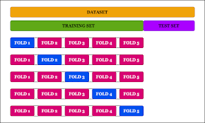

```{r setup, include=FALSE}
knitr::opts_chunk$set(echo = TRUE)
library(tidyverse)
library(corrplot)
library(mctest)
library(caret)
library(glmnet)
```

# Regularyzacja LASSO, Ridge, Elastic Net

## Przedstawienie problemu

Ponizsze dane zawierają informację na temat współczynnika genetycznego pewnej choroby oraz ekspresji genów dla $1000$ pacjentów. Naszym zadaniem będzie sprawdzenie zależności (zdudowanie modelu statystycznego) pomiędzy informacją genetyczną, a indeksem chorobowym. 

```{r, message=FALSE}
gene_data <- read_csv("gene expression.csv")
```

Poniewaz zmienna $disease_indicator$ przyjmuje wartości z przestrzeni liczb rzeczywistych moglibyśmy użyć znanego nam już modelu regresji liniowej.

```{r, warning=FALSE, message=FALSE}
set.seed(1234)
train_rows <- sample(1:nrow(gene_data), 0.66*nrow(gene_data))
gene_data_train <- gene_data[train_rows, ]
gene_data_test <- gene_data[-train_rows, ]

gene_data_lm <- lm(
  formula = disease_indicator ~ ., data = gene_data_train
)

print(paste("R^2 dla modelu:", summary(gene_data_lm)$r.squared))
print(paste("Suma kwardratów reszt dla zb. treningowego:", sum(gene_data_lm$residuals^2)))
print(paste("Suma kwardratów reszt dla zb. testowego:", sum((gene_data_test$disease_indicator - predict(gene_data_lm, gene_data_test))^2)))
```

Od razu widzimy, że coś jest nie tak. Na zbiorze treningowym osiaga idealny - zerowy - błąd, na zbiorze testowym jednak wypada on fatalnie. Jest to typowy przypkad **overfittingu**, czyli **zbyt wysokiej wariancji modelu**. Overfitting spowodowany jest uzyciem zbyt elastycznego modelu, jednakże zazwyczaj rozumiemy to poprzez użycie zbyt elastycznej architektury jak np. sieci nauronowego do prostego problemu. Model regresji liniowej jest bardzo prostym modelem więc nie powinno byc z tym problemu. 

Overfitting może jednak występować także dla prostych modeli w przypadku gdy posiadamy więcej predyktorów niż obserwacji: $p \geq N$. We wspomianym przypadku estymatory oparte na metodzie największej wiarygodności jak i na metodzie najmniejszych kwadratów narażone sa na przeuczenie modelu. 

Zwizualizujmy co się dzieje na prostym przykładzie zakładając, że mamy w naszym zbiorze treningowym tylko 2 obserwacje i używamy jednego predyktora (dodając wyraz wolny mamy $p=N$). W takim przypadku łatwo zauważyć, że model regresji liniowej da nam po prostu wzór na linię przechodzącą przez obie obserwacje:

```{r}
set.seed(2222)
sample_data <- tibble(
  x = 1:7,
  y = 2*x + 1 + rnorm(7),
  set = c("train", "test", "train", rep("test", 4))
)
test_model <- lm(data = sample_data %>% filter(set == "train") %>% select(-set), formula = y ~ .)
test_model_intercept <- test_model$coefficients["(Intercept)"]
test_model_slope <- test_model$coefficients["x"]

ggplot(sample_data, aes(x, y, color = set)) + theme_bw() + geom_point() +
  geom_abline(intercept = test_model_intercept, slope = test_model_slope)
```

## Regresja grzbietowa

Aby rozwiazać ten problem musimy zastanowić się jak zmnieszyć wariancję naszego modelu. Wariancja i obciążenie (bias) są ze sobą ścisle powiązane. Zmniejszająć jedno zwiększamy drugie - bias-variance tradeoff, tak więc moglibyśmy sprawdzić co stanie się gdy do naszego modelu dodamy obciażanie. dokonamy tego dodając **regularyzacji** naszego modelu, karając model za zbyt wysokie współczynniki $\beta$. Mówiąc dokładniej w regularyzowanej wersji naszego modelu minimalizować będziemy nie loglikelihood (lub błąd kwadratowy), a poniższe wyrażenie:

$$
\hat{\beta} = agrmin_{\beta} (-\ell(\beta) + \lambda\sum_{i=1}^p \beta_p^2)
$$

Jest to tak zwana **regresja grzbietowa** (Ridge regression). Parametr $\lambda$ jest **hiperparametrem** modelu, który musimy ustalić. Jest to tak zwany **współczynnik kary** - im większa $\lambda$ tym bardziej "karamy" nasz model za zbyt duże wartości parametrów. W przypadku regresji liniowej wartość likelihood mozemy zastąpić błędem kwadratowym, i bezpośrednio znaleźć postać rozwiązania:

$$
\hat{\beta} = (X^TX + \lambda I)^{-1}X^Ty
$$
Zwizualizujmy rozwiązanie regresji grzbietowej dla kilku wartości $\lambda$:

```{r}
X <- cbind(1, sample_data %>% filter(set == "train") %>% dplyr::select(x)) %>% as.matrix()
y <- sample_data %>% filter(set == "train") %>% dplyr::select(y) %>% as.matrix()
ridge_intercept <- sample_data %>% filter(set == "train") %>% pull(y) %>% mean()
solution_lambda_1 <- solve(t(X)%*%X + 1*diag(2))%*%t(X)%*%y
solution_lambda_5 <- solve(t(X)%*%X + 5*diag(2))%*%t(X)%*%y
solution_lambda_10 <- solve(t(X)%*%X + 10*diag(2))%*%t(X)%*%y
ggplot(sample_data, aes(x, y, color = set)) + theme_bw() + geom_point() +
  geom_abline(intercept = test_model_intercept, slope = test_model_slope, color = "blue") +
  geom_text(aes(x = 1.5, y = 14, label = "lambda=0"), color = "blue") +
  geom_abline(intercept = solution_lambda_1[1,1], slope = solution_lambda_1[2,1], color = "green") +
  geom_text(aes(x = 1.5, y = 13, label = "lambda=1"), color = "green") +
  geom_abline(intercept = solution_lambda_5[1,1], slope = solution_lambda_5[2,1], color = "red") +
  geom_text(aes(x = 1.5, y = 12, label = "lambda=5"), color = "red") +
  geom_abline(intercept = solution_lambda_10[1,1], slope = solution_lambda_10[2,1], color = "black") +
  geom_text(aes(x = 1.5, y = 11, label = "lambda=10"), color = "black")
```

Oczywiście pojawia się pytanie, jak wybrać wielkość $lambda$ ? Parametr ten wybierany jest w procesie **cross-walidacji** (CV). CV jest prostą lecz skuteczną metodą estymacji błędu generalizacji dlatego też doskonale nadaje się do estymacji wartości wszelkich hiperparametrów. 

W procesie CV dzielimy nasz zbiór treningowy na **foldy** równej wielkości. Nastepnie budujemy $K$ modeli za nowy zbiór treningowy biorąc $K-1$ foldów - w kazdym z modeli pozostający fold jest traktowany jako zbiór walidacyjny. Nastepnie uśredniamy wyniki (np. bład sredniokwadratowy) ze zbiorów walidacyjnych otrzymując estymację zbioru generalizacyjnego.



```{r}
gene_data_train_x <- gene_data_train %>% select(-disease_indicator) %>% as.matrix()
gene_data_train_y <- gene_data_train %>% pull(disease_indicator)
gene_data_test_x <- gene_data_test %>% select(-disease_indicator) %>% as.matrix()
gene_data_test_y <- gene_data_test %>% pull(disease_indicator)

gene_data_ridge <- cv.glmnet(gene_data_train_x, gene_data_train_y, type.measure = "mse", 
                             alpha = 0, family = "gaussian")
print(paste("Wartość lambda.1se - wartość kary, która daje nam najprostszy model (najmniej niezerowych parametrów) i jest w granicy 1 błędu standardowego lambdy z najmniejszą sumą kwadratów (lambda.min) wynosi:", gene_data_ridge$lambda.1se))
print(paste("Wartość lambda.min - wartość kary dająca najmniejszą suwę kwadratów:", gene_data_ridge$lambda.min))
plot(gene_data_ridge)
plot(gene_data_ridge$glmnet.fit)
```

Mozy teraz policzyć predykcje:

```{r}
gene_data_ridge_predicted_train <- 
  predict(gene_data_ridge, s = gene_data_ridge$lambda.1se, newx = gene_data_train_x)
gene_data_ridge_predicted_test <- 
  predict(gene_data_ridge, s = gene_data_ridge$lambda.1se, newx = gene_data_test_x)
print(paste("Suma kwardratów reszt dla zb. treningowego:", sum((gene_data_train_y - gene_data_ridge_predicted_train)^2)))
print(paste("Suma kwardratów reszt dla zb. testowego:", sum((gene_data_test_y - gene_data_ridge_predicted_test)^2)))
```

Regresja grzbietowa jest przykładem **regularyzacji normą $L^q$** gdzie $q=2$:

$$
\hat{\beta} = agrmin_{\beta} (-\ell(\beta) + \lambda\sum_{i=1}^p |\beta_p|^q)
$$
```{r}
gen_norm <- function(x, q) {(1 - abs(x^q))^(1/q)}
q_norms <- c(0.3, 0.5, 1, 2, 3, 5, 20) %>% map_df(~ {
  q <- .x
  points <- tibble(
    x = seq(0, 1, by = 0.001),
    y = gen_norm(x, q),
    q = q
  )
  bind_rows(points, points %>% mutate(y = -y),
            points %>% mutate(x = -x),
            points %>% mutate(x = -x, y = -y))
}) %>% mutate(q = as.factor(q)) %>%
  arrange(q, y, x)
ggplot(q_norms, aes(x, y, color = q, group = q)) + theme_bw() + geom_point()
```

## Regresja LASSO

Moznaby się zastanowić co stanie się gdy użyjemy innej normy do regularyzacji. Najczęsciej spotykanym kuzynem regresji grzbietowej jest **regresja LASSO** (least absolute shrinkage and selection operator), gdzie $q=1$:

$$
\hat{\beta} = agrmin_{\beta} (-\ell(\beta) + \lambda\sum_{i=1}^p |\beta_p|)
$$

```{r}
gene_data_lasso <- cv.glmnet(gene_data_train_x, gene_data_train_y, type.measure = "mse", 
                             alpha = 1, family = "gaussian")
print(paste("Wartość lambda.1se - wartość kary, która daje nam najprostszy model (najmniej niezerowych parametrów) i jest w granicy 1 błędu standardowego lambdy z najmniejszą sumą kwadratów (lambda.min) wynosi:", gene_data_lasso$lambda.1se))
print(paste("Wartość lambda.min - wartość kary dająca najmniejszą suwę kwadratów:", gene_data_lasso$lambda.min))
plot(gene_data_ridge)
plot(gene_data_lasso$glmnet.fit)
```

Analogicznie policzmy predykcje i średni błąd:

```{r}
gene_data_lasso_predicted_train <- 
  predict(gene_data_lasso, s = gene_data_lasso$lambda.1se, newx = gene_data_train_x)
gene_data_lasso_predicted_test <- 
  predict(gene_data_lasso, s = gene_data_lasso$lambda.1se, newx = gene_data_test_x)
print(paste("Suma kwardratów reszt dla zb. treningowego:", sum((gene_data_train_y - gene_data_lasso_predicted_train)^2)))
print(paste("Suma kwardratów reszt dla zb. testowego:", sum((gene_data_test_y - gene_data_lasso_predicted_test)^2)))
```

Jak widzimy dopasowanie jest jeszcze lepsze w przypadku LASSO niż regresji grzbietowej. Widać takze pewną różnicę jesli chodzi o wartości współczynników $\beta$. W regresji grzbietowej niektóre wartości są bliskie 0, ale nigdy nie osiągają tej wartości - metoda regresji grzbietowej pozwala tylko na dojście asymptotycznie blisko do 0. W przypadku LASSO dostajemy zerowe współczynniki - daje nam to bardzo przydatną własność, bo LASSO działa jak **selektor zmiennych**.

## Regresja Elastic Net

LASSO daje z reguły lepsze wyniki gdy w naszym zbiorze mamy nieistotne predyktory (zmienne które nie wnoszą informacji do modelu), LASSO potrafi się ich pozbyć. Regresja grzbietowa działa lepiej gdy predyktory są istotne. Jeśli chcemy korzystać z zalet obu podejść możemy użyć regresji **Elastic Net**:

$$
\hat{\beta} = agrmin_{\beta} (-\ell(\beta) + \lambda(\alpha\sum_{i=1}^p |\beta_p| + (1-\alpha)\sum_{i=1}^p \beta_p^2))
$$
```{r}
gene_data_elastic_net <- cv.glmnet(gene_data_train_x, gene_data_train_y, type.measure = "mse", 
                             alpha = 0.5, family = "gaussian")
print(paste("Wartość lambda.1se - wartość kary, która daje nam najprostszy model (najmniej niezerowych parametrów) i jest w granicy 1 błędu standardowego lambdy z najmniejszą sumą kwadratów (lambda.min) wynosi:", gene_data_elastic_net$lambda.1se))
print(paste("Wartość lambda.min - wartość kary dająca najmniejszą suwę kwadratów:", gene_data_elastic_net$lambda.min))
plot(gene_data_ridge)
plot(gene_data_elastic_net$glmnet.fit)

gene_data_elastic_net_predicted_train <- 
  predict(gene_data_elastic_net, s = gene_data_elastic_net$lambda.1se, newx = gene_data_train_x)
gene_data_elastic_net_predicted_test <- 
  predict(gene_data_elastic_net, s = gene_data_elastic_net$lambda.1se, newx = gene_data_test_x)
print(paste("Suma kwardratów reszt dla zb. treningowego:", sum((gene_data_train_y - gene_data_elastic_net_predicted_train)^2)))
print(paste("Suma kwardratów reszt dla zb. testowego:", sum((gene_data_test_y - gene_data_elastic_net_predicted_test)^2)))
```

Wartość $\alpha$ jest kolejnym hiperparametrem który należałoby wybrać z użyciem CV i metody seleckji jak np grid search.