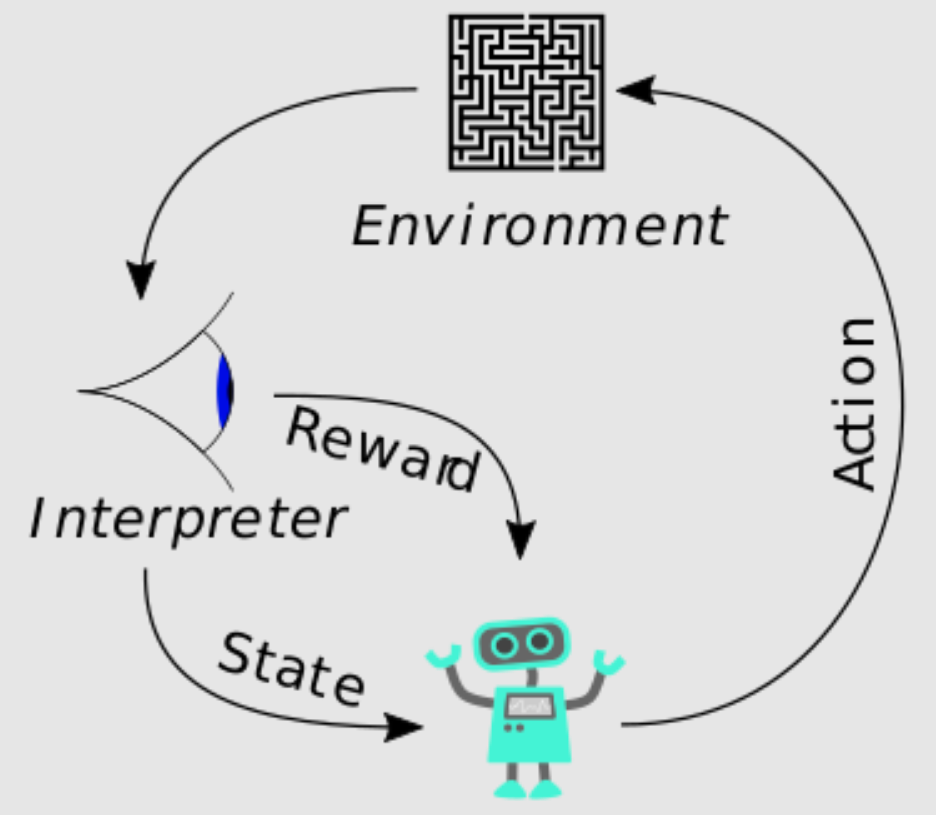

```{r setup, include=FALSE}
knitr::opts_chunk$set(echo = TRUE, fig.path="imgs/")
library(tidyverse)
library(R6)
library(plotly)
```

# Reinforcment learning

**Uczenie ze wzmocnieniem** (Reinforcment learning) to to obszar uczenia maszynowego dotyczący tego, jak **inteligentni agenci** powinni podejmować działania w **środowisku**, aby zmaksymalizować pojęcie **skumulowanej nagrody**. Uczenie ze wzmocnieniem jest jednym z trzech podstawowych paradygmatów uczenia maszynowego, obok uczenia nadzorowanego i uczenia nienadzorowanego.

Uczenie ze wzmacnianiem różni się od uczenia nadzorowanego brakiem konieczności przedstawiania oznaczonych par wejścia/wyjścia oraz brakiem konieczności wyraźnej korekty działań suboptymalnych. Zamiast tego skupiamy się na znalezieniu równowagi między **eksploracją** (niezbadanego terytorium) a **eksploatacją** (obecnej wiedzy).




Środowisko zazwyczaj definiowane jest jako **Proces Decyzyjny Markova** (Markov decision process), który jest rozszerzeniem klasycznego **Łańcucha Markova** o mozliwość wyboru akcji oraz otrzymaniu nagrody/kary za tę akcję.

Bardziej formalnie. Obiekt $(S,A,P_a,R_a)$ nazywamy procesem decyzyjnym Markova, gdzie:

- $S$ jest zbiorem wyszystkich stanów naszego procesu
- $A$ jest zbiorem wszystkich akcji naszego procesu ($A_s$ będzie zbiorem akcji dozwolonych dla stanu $s$)
- $P_a(s,s') = P(s_{t+1} = s'| s_t=s, a_t=a)$ jest prawdopodobieństwem tego, że akcja $a$ w stanie $s$ w czasie $t$ doprowadzi do stanu $s'$ w czasie $t+1$.
- $R_a(s,s')$ jest natychmiastową nagrodą (lub oczekiwaną natychmiastową nagrodą) otrzymana po przejsciu ze stanu $s$ to $s'$ poprzez akcję $a$.

Do rozwiązania problemów uczenia ze wzmocnieniem bardzo często używa się **programowania dynamicznego**. Celem uczenia ze wzmocnieniem jest nauczenie agenta optymalnej (bądź prawie optymalnej) taktyki tak, aby zmaksymalizować **funkcję nagrody**.

Jeśli zakładamy, że agent jest w stanie zobaczyć wszystkie stany środowiska problem może zostać zdefiniowany jako klasyczny Proces Decyzyjny Markova, jeśli z jakiegoś powodu agent może zobaczyć tylko część stanów to preblem musi być zdefiniowany jako **Częściowo obserwowalny Proces Decyzyjny Markova**.

## Q-learning

**Q-learning** jest algorytmem pozwalającym na znalezienie optymalnej taktyki (dla skończonych Procesów Decyzyjnych Markova) pod względem maksymalizacji oczekiwanej funkcji nagrody (dla kolejnych kroków począwszy od obecnego kroku $s$).

Litera **Q** oznacza jakość (quality). Algorytm kalkuluje wartości Q dla par stan-akcja i na ich podstawie podejmuje kolejne działania (akcje). Wartości Q aktualizowane są przy pomocy **równania Bellman'a**:

$$
Q^{new}(s_t, a_t) = Q(s_t, a_t) + \alpha \cdot ( r_t + \gamma \cdot \max_{a}Q(s_{t+1}, a) - Q(s_t, a_t))
$$
gdzie:

- $Q(s_t, a_t)$ to obecna jakość akcji $a$ w stanie $s$.
- $\alpha$ to **learning rate** ($0<\alpha<1$) odpowiadające za tempo uczenia się.
- $r_t$ to nagroda za podjecie akcji $a$ ze stanu $s$ w czasie $t$.
- $\gamma$ to współczynnik degeneracji oznaczający wagę przyszłych nargód.
- $\max_{a}Q(s_{t+1}, a)$ to maksymalna nagroda jaka może być osiągnięta w kroku $t+1$

Jeśli $r_t$ jest równe zero to wzór upraszcza się do:

$$
Q^{new}(s_t, a_t) = (1- \alpha) \cdot Q(s_t, a_t) + \alpha \cdot \gamma \cdot \max_{a}Q(s_{t+1}, a)
$$

## Gra w kółko i krzyżyk

Aby pokazać działanie Q-learningu zaczniemy od gry w kółko i krzyżyk. Zaczniemy od stworzenia klasy, który pozwoli na przeprowadzenie rozgrywki:

```{r}
TicTacToe <- R6Class(
  classname = "TicTacToe",
  public = list(
    initialize = function(size, player1, player2) {
      stopifnot(is.integer(size) & size < 6 & size > 2)
      private$size <- size
      private$player1 <- player1
      private$player2 <- player2
      private$current_state <- rep(0, size^2)
      private$current_state_mat <- private$transform_current_state_to_matrix()
    },
    print = function() {
      for (r in 1:private$size) {
        print(paste(private$transform_values_to_symbols(private$current_state_mat[r, ]),
                    collapse = " | "))
        if (r < private$size) print(paste(rep("-", 4 * private$size - 3), collapse = ""))
      }
      cat("\n")
    },
    get_current_state = function() {
      private$current_state
    },
    get_current_state_mat = function() {
      private$current_state_mat
    },
    get_results = function() {
      private$results
    },
    apply_move = function(move, player, print = FALSE) {
      empty_cells = private$find_empty_cells()
      if (move %in% empty_cells) {
        private$current_state[move] <- private$transform_symbols_to_values(player$get_symbol())
        private$current_state_mat <- private$transform_current_state_to_matrix()
        if (print) self$print()
      } else {
        stop("Non-empty cell selected!")
      }
    },
    apply_q_learning = function(winner) {
      if (private$player1$get_strategy() == "q") {
        if (winner == "tie") {
          private$player1$learn_q(0.5)
        } else if (winner == private$player1$get_name()) {
          private$player1$learn_q(10)
        } else {
          private$player1$learn_q(0)
        }
      }
      if (private$player2$get_strategy() == "q") {
        if (winner == "tie") {
          private$player2$learn_q(0.5)
        } else if (winner == private$player2$get_name()) {
          private$player2$learn_q(10)
        } else {
          private$player2$learn_q(0)
        }
      }
    },
    restart_game = function(winner, print = FALSE) {
      if (print) print(paste("Game over. Result:", winner))
      private$results <- c(private$results, winner)
      private$current_state <- rep(0, private$size^2)
      private$current_state_mat <- private$transform_current_state_to_matrix()
    },
    play = function(rounds = 1, print = FALSE) {
      for (round in 1:rounds) {
        repeat {
          move1 <- private$player1$move(private$current_state)
          self$apply_move(move1, private$player1, print)
          winner <- private$check_for_game_end()
          if (!is.na(winner)) {
            self$restart_game(winner, print)
            self$apply_q_learning(winner)
            break
          }
          move2 <- private$player2$move(private$current_state)
          self$apply_move(move2, private$player2, print)
          winner <- private$check_for_game_end()
          if (!is.na(winner)) {
            self$restart_game(winner, print)
            self$apply_q_learning(winner)
            break
          }
        }
      }
    }
  ),
  private = list(
    size = NULL,
    player1 = NULL,
    player2 = NULL,
    results = c(),
    current_state = NULL,
    current_state_mat = NULL,
    transform_current_state_to_matrix = function() {
      matrix(private$current_state, private$size, private$size)
    },
    transform_values_to_symbols = function(value) {
      case_when(
        value == 1 ~ private$player1$get_symbol(),
        value == -1 ~ private$player2$get_symbol(),
        TRUE ~ " "
      )
    },
    transform_symbols_to_values = function(symbol) {
      case_when(
        symbol == private$player1$get_symbol() ~ 1,
        symbol == private$player2$get_symbol() ~ -1,
        TRUE ~ 0
      )
    },
    find_empty_cells = function() {
      which(private$current_state == 0)
    },
    check_for_game_end = function() {
      if (any(rowSums(private$current_state_mat) == private$size) |
          any(colSums(private$current_state_mat) == private$size) |
          sum(diag(private$current_state_mat)) == private$size |
          sum(diag(private$current_state_mat[private$size:1, ])) == private$size) {
        private$player1$get_name()
      } else if (any(rowSums(private$current_state_mat) == -private$size) |
                 any(colSums(private$current_state_mat) == -private$size) |
                 sum(diag(private$current_state_mat)) == -private$size |
                 sum(diag(private$current_state_mat[private$size:1, ])) == -private$size) {
        private$player2$get_name()
      } else if (length(private$find_empty_cells()) == 0) {
        "tie"
      } else {
        NA
      }
    }
  )
)
```

oraz klasy, która odpowiadać będzie za ruchy gracza:

```{r}
TicTacToePlayer <- R6Class(
  classname = "TicTacToePlayer",
  public = list(
    initialize = function(name, symbol, is_player1, strategy = "random",
                          alpha = 0.99, gamma = 0.975, beta = 0.8) {
      stopifnot(nchar(symbol) == 1)
      private$name <- name
      private$symbol <- as.character(symbol)
      private$strategy <- strategy
      private$player_value <- if (is_player1) 1 else -1
      private$alpha <- alpha
      private$gamma <- gamma
      private$beta <- beta
    },
    get_name = function() {
      private$name
    },
    get_symbol = function() {
      private$symbol
    },
    get_strategy = function() {
      private$strategy
    },
    get_q_table = function() {
      private$q_table
    },
    load_q_table = function(path) {
      private$q_table <- read_rds(path)
    },
    move = function(state) {
      if (private$strategy == "random") {
        private$move_random(state)
      } else if (private$strategy == "q") {
        private$move_q(state)
      }
    },
    learn_q = function(reward) {
      alpha <- private$alpha
      gamma <- private$gamma
      private$q_table[[
        private$create_state_id(private$previous_state)]][[
          private$create_state_id(private$current_state)]]$q <- reward
      private$previous_state <- NULL
      
      for (state_id in rev(names(private$q_table))) {
        actions <- private$q_table[[state_id]]
        for (next_move_id in names(actions)) {
          next_move_actions <- private$q_table[[next_move_id]]
          if (!is.null(next_move_actions)) {
            best_next_q <- next_move_actions %>% map_dbl(~ .$q) %>% max()
            actions[[next_move_id]]$q <- (1 - alpha) * actions[[next_move_id]]$q +
              gamma * alpha * best_next_q
          }
          private$q_table[[state_id]] <- actions
        }
      }
      private$alpha <- alpha * gamma
    }
  ),
  private = list(
    name = NULL,
    symbol = NULL,
    strategy = NULL,
    player_value = NULL,
    alpha = 0.15,
    gamma = 0.99,
    beta = 0.6,
    q_table = list(),
    current_state = NULL,
    previous_state = NULL,
    get_size = function(state) {
      sqrt(length(state))
    },
    find_empty_cells = function(state) {
      which(state == 0)
    },
    sample_from_cells = function(empty_cells) {
      if (length(empty_cells) > 1) {
        sample(empty_cells, size = 1)
      } else {
        empty_cells
      }
    },
    move_random = function(state) {
      empty_cells = private$find_empty_cells(state)
      private$sample_from_cells(empty_cells)
    },
    create_state_id = function(state, action = NA) {
      if (!is.na(action)) {
        state[action] <- private$player_value
      }
      paste0(state, collapse = "")
    },
    compare_state_ids = function(state1, state2) {
      state1_clean = gsub("-", "", state1)
      state2_clean = gsub("-", "", state2)
      which(strsplit(state1_clean, "")[[1]] != strsplit(state2_clean, "")[[1]])
    },
    initialize_q_table_for_state = function(state) {
      actions <- list()
      empty_cells <- private$find_empty_cells(state)
      for (cell in empty_cells) {
        actions[[private$create_state_id(state, cell)]] <- list(action = cell, q = private$beta)
      }
      state_id <- private$create_state_id(state)
      private$q_table[[state_id]] <- actions
    },
    move_q = function(state) {
      state_id <- private$create_state_id(state)
      if (!is.null(private$previous_state)) {
        current_state_id <- private$create_state_id(private$current_state)
        actions <- private$q_table[[current_state_id]]
        if (!(state_id %in% names(actions))) {
          actions[[state_id]] <- list(action = private$compare_state_ids(state_id, current_state_id),
                                      q =  private$beta)
        }
      }
      
      # Losowanie najoptymalniejszej akcji
      state_in_q_table <- state_id %in% names(private$q_table)
      if (!state_in_q_table) {
        private$initialize_q_table_for_state(state)
      }
      actions <- private$q_table[[state_id]]
      best_q <- actions %>% map_dbl(~ .$q) %>% max()
      best_actions <- actions %>% keep(~ .$q == best_q) %>% map(~ .$action) %>% unlist()
      best_action <- private$sample_from_cells(best_actions)
      # Update współrzędnych
      private$previous_state <- state
      state[best_action] <- private$player_value
      private$current_state <- state
      # Wynik Q-learningu
      best_action
    }
  )
)
```

Zacznijmy od wizualizacji wyników dla graczy losowych:

```{r}
p1 <- TicTacToePlayer$new(name = "p1", symbol = "x", is_player1 = TRUE, strategy = "random")
p2 <- TicTacToePlayer$new(name = "p2", symbol = "o", is_player1 = FALSE, strategy = "random")
random_vs_random <- TicTacToe$new(size = 3L, p1, p2)
rounds <- 1000
random_vs_random$play(rounds)
random_vs_random_results <- tibble(
  round = 1:rounds,
  winner = random_vs_random$get_results(),
  value = 1) %>%
  spread(winner, value, fill = 0) %>%
  mutate_at(vars(-round), list(~ cumsum(.) / round)) %>%
  gather(key = "winner", value = "wins percentage", -round)

ggplotly(ggplot(random_vs_random_results, aes(round, `wins percentage`)) +
           theme_bw() + geom_line(aes(color = winner)))
```

A także dla Q-learningu

```{r}
p1 <- TicTacToePlayer$new(name = "p1", symbol = "x", is_player1 = TRUE, strategy = "random")
p2 <- TicTacToePlayer$new(name = "p2", symbol = "o", is_player1 = FALSE, strategy = "q")
p2$load_q_table("q_table_10000.RDS")
random_vs_q <- TicTacToe$new(size = 3L, p1, p2)
rounds <- 1000
random_vs_q$play(rounds)
random_vs_q_results <- tibble(
  round = 1:rounds,
  winner = random_vs_q$get_results(),
  value = 1) %>%
  spread(winner, value, fill = 0) %>%
  mutate_at(vars(-round), list(~ cumsum(.) / round)) %>%
  gather(key = "winner", value = "wins percentage", -round)

ggplotly(ggplot(random_vs_q_results, aes(round, `wins percentage`)) +
           theme_bw() + geom_line(aes(color = winner)))
```