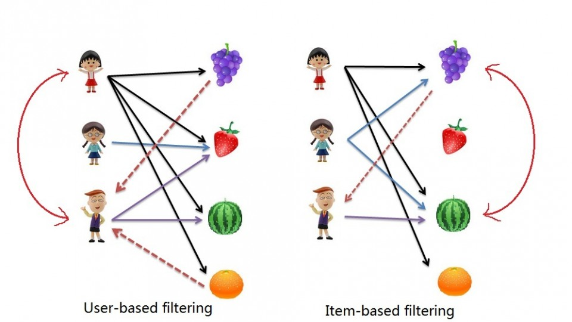
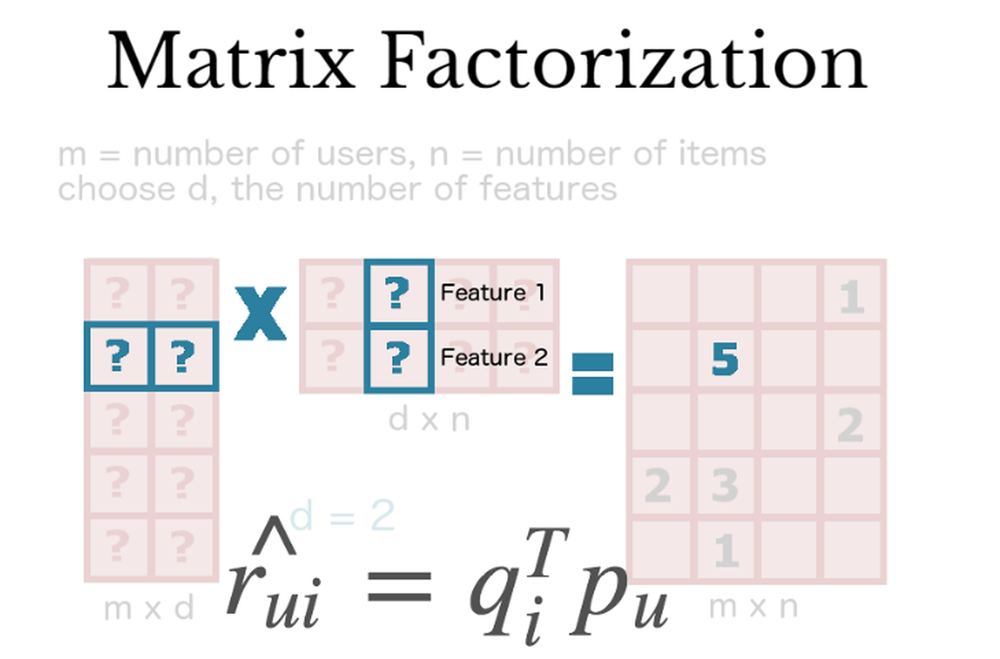

```{r setup, include=FALSE}
knitr::opts_chunk$set(echo = TRUE, fig.path="imgs/")
library(tidyverse)
library(tm)
library(text2vec)
library(recommenderlab)
```

# Systemy rekomendacyjne

**Systemy rekomendujące** to systemy zaprojektowane w celu polecania rzeczy użytkownikowi na podstawie wielu różnych czynników. Systemy te przewidują najbardziej prawdopodobny produkt, który użytkownicy najprawdopodobniej kupią i którymi są zainteresowani.

## Popularity-Based Recommendation System

Systemy oparte na popularności produktu (Popularity-Based Recommendation System) - Systemy te sprawdzają, jakie produkty są modne lub cieszą się największą popularnością wśród użytkowników i bezpośrednio je polecają. Na przykład, jeśli produkt jest często kupowany przez większość ludzi, system dowie się, że ten produkt jest najpopularniejszy, więc dla każdego nowego użytkownika system zarekomenduje ten produkt również temu użytkownikowi i jest duże prawdopodobieństwo, że nowy użytkownik również go kupi.

Zaletą takiego systemu jest brak problemów z **zimnym startem** (cold start problem) - model nie korzysta z danych historycznym o klientach, więc jest w stanie zaproponować coś nowemu klientowi bez historii. Wadą jest brak personalizacji rekomendacji.

Przykłady:
YouTube: Trending videos
Google News: News filtered by trending and most popular news.

## Clasification-Based Recommendation System

System opartty na klasyfikacji (Clasification-Based Recommendation System) - Systemy te oparte są o klasyczne algorytmy klasyfikacji ML (regresja logistyczna, Random Forest, XGBoost, sieci neuronowe, ...). Predyktorami mogą być zakupione lub polubione produkty, a zmienną objaśnianą dokonanie zapupu lub polubienie nowego produktu.

## Content-Based Recommendation System

System oparty na zawartości/treści (Content-Based Recommendation System) - Systemy te oparte są na podobieństwie między **profilu produktu, a profilem użytkownika**. Jeśli użytkownik ogląda film, system sprawdzi inne filmy o podobnej treści lub z tego samego gatunku filmu, który ogląda użytkownik. Istnieje wiele podstawowych atrybutów, które służą do obliczania podobieństwa podczas sprawdzania podobieństwa treści. W systemach tego typu nie potrzebujemy informacji o ocenie użytkownika a tylko o zakupie/polubieniu/obejrzeniu.

Zacznijmy od wczytania danych dotyczących filmów z IMDB (póki co ograniczymy się do kilku zmiennych):

```{r, warning=FALSE, message=FALSE}
IMDB <- read_csv("IMDB_Top250Engmovies2_OMDB_Detailed.csv") %>%
  select('Title', 'Genre', 'Director', 'Actors', 'Plot', 'Rated')
```

Potrzebne nam jeszcze zestawy filmów przypisane do użytkowników (historia oglądania):

```{r}
history <- list(
  c("Inception", "Interstellar", "Guardians of the Galaxy Vol. 2", 
    "Logan", "The Terminator", "Guardians of the Galaxy", "Aliens", 
    "Eternal Sunshine of the Spotless Mind", "Donnie Darko", "Terminator 2: Judgment Day",
    "Harry Potter and the Deathly Hallows: Part 2", "The Princess Bride", 
    "Indiana Jones and the Last Crusade", "The Lord of the Rings: The Return of the King", 
    "The Green Mile", "Star Wars: Episode VI - Return of the Jedi", 
    "Star Wars: The Force Awakens", "It's a Wonderful Life", "Beauty and the Beast", 
    "The Nightmare Before Christmas"),
  c("Rear Window", "Léon: The Professional", "Strangers on a Train", 
    "The Manchurian Candidate", "Kill Bill: Vol. 1", "The Bourne Ultimatum", 
    "The Silence of the Lambs", "Memento", "Psycho", "V for Vendetta", "The Thing",
    "What Ever Happened to Baby Jane?", "The Exorcist", "Gone Girl", "Se7en")
)
```

Rozpatrzmy 2 przypadki. W pierwszym chcielibyśmy rekomendować filmy tylko za pomocą zmiennych `Genre` oraz `Rated`, czyli klasycznych danych tabularycznych (pomijamy zmienne zawierające tekst). W tym przypadku prifil filmowy będzie wyglądać następująco:

```{r}
IMDB_tabluar <- IMDB %>%
  unite("texts", c('Genre', 'Rated'), sep = ", ") %>%
  select(Title, texts) %>%
  separate_rows(texts, sep = ", ") %>%
  mutate(value = 1) %>%
  spread(texts, value, fill = 0)
```

Profil użytkownika będzie natomiast wektorem średnich wartości z każdej kolumny (zmiennej) dla filmów, które obejrzał dany użytkownik:

```{r}
user_profile <- history %>% map_df(~ IMDB_tabluar %>%
                                     filter(Title %in% .x) %>%
                                     select(-Title) %>%
                                     summarise_all(list(mean)))
user_profile
```

Ostatnim krokiem jest policzenie podobieństwa miedzy profilem (wektorem) użytkownika, a produktu (filmu w tym przypadku). W zależności od tego z jakimi zmiennymi mamy do czynienia możemy użyć różnych funkcji do policzenia podobieństwa jak np. **odległość euklidesowa**. W tym przypadku skorzystamy z **cosine similarity**:

$$
SIM_{cosine}(X, Y) = \frac{XY}{|X||Y|} = \frac{\sum_{i=1}^nx_iy_i}{\sqrt{\sum_{i=1}^nx_i^2}\sqrt{\sum_{i=1}^ny_i^2}} = cos(\theta)
$$

```{r}
cos_sim <- sim2(IMDB_tabluar %>%
                  select(-Title) %>%
                  as.matrix(),
                user_profile %>% as.matrix(),
                method = "cosine") %>%
  as.data.frame() %>%
  rename(User1 = V1, User2 = V2) %>%
  mutate(Title = IMDB$Title)
```

Następnie możemy zarekomendować filmy, które najbardziej przypominają profil użytkownika (po uprzednim odfiltrowaniu filmów, które już widział):

```{r}
cos_sim %>%
  filter(!(Title %in% history[[1]])) %>%
  arrange(desc(User1)) %>% head(10) %>% pull(Title)
```


```{r}
cos_sim %>%
  filter(!(Title %in% history[[2]])) %>%
  arrange(desc(User2)) %>% head(10) %>% pull(Title)
```

Jeśli chcielibyśmy użyć danych tekstowych musimy sie zastanowić jak stworzyć profile produktu i użytkownika (jak przedstawić zmienne/predyktory). 

```{r}
IMDB_texts <- IMDB %>% unite("texts", c('Genre','Director','Actors','Plot'), sep = " ") %>% pull(texts)
head(IMDB_texts)
```

W przypadku tekstu zazwyczaj będziemy chcieli zmienić surowy ciąg znakót na tokeny, w naszym przypadku będą to pojedyncze słowa. Aby tego dokonać musimy wyczyścić teksty i odpowiednio je podzielić. W pierwszej kolejności powinniśmy zmienić wielkie na małe litery (aby słowa nie powtarzały się), usunąć znaki specjalne, cyfry itd. Następnie usunąć **stopwords** czyli słowa, które nie wnoszą nic do predykcji (np. a, the, ...) oraz dokonać **stemmingu lub lematyzacji**. Pozostałe słowa tworzą tak zwany **korpus / słownik** (zwykle ogrniczamy się do najczęściej występujących słów np 90%).

Stemming - bazując na definicji z angielskiej wikipedii jest to proces polegający na wydobyciu z wybranego wyrazu tzw. rdzenia, a więc tej jego części, która jest odporna na odmiany przez przyimki, rodzaje itp.

Lematyzacja - pojęcie to jest bardzo podobne do powyższego, a oznacza sprowadzenie grupy wyrazów stanowiących odmianę danego zwrotu do wspólnej postaci, umożliwiającej traktowanie ich wszystkich jako te samo słowo.

```{r}
IMDB_texts_clean <- IMDB_texts %>%
  tolower() %>% # Zmiana na małe litery, aby słowa się nie powtarzały
  gsub("[[:punct:]]", "", .) # Usuwanie znaków specjanlych: przecinki, kropki itd.

IMDBCorpus <- VCorpus(VectorSource(IMDB_texts_clean),  readerControl = list(language = "en"))
IMDBCorpus <- tm_map(IMDBCorpus, removeWords, stopwords("english")) # Usuwanie stopwords
IMDBCorpus <- tm_map(IMDBCorpus, stemDocument, language = "english") # Stemming / lematyzacja
```

Kolejnym krokiem jest utworznie profilu produktów. Utworzymy macierz zwaną **Document-Term Matrix**, w której wiersz odpowiada jednemu filmowi (ogołnie dokumentowi / tekstowi), a kolumna jednemu słowa z naszeo słownika.

DTM w najprostszym przypadku miałaby zwyczajnie częstotliwosć słów występującą w danym tekście, jednakże aby lepiej odwzorować impakt danego tokena (słowa) w dokumencie dokonamy ważenia metodą **TF-IDF** (term frequency–inverse document frequency). Problem polega na tym, że możemy mieć dwa teksty, w którym słowo `W` występuje 5 razy, jednakże jeśli tekst nr jeden ma łącznie długość 300 słów, a tekst nr dwa 30000 słów to waga słowa `W` w tych dokumentach może być inna, czego nie odzwierciedla zwykła częstość występowania w dokumencie.

Wagi TF-IDF oblicza się jako iloczyn dwóch wyrazeń:

$$
(tf_-idf)_{i,j} = tf_{i,j}*idf_i
$$

Term Frequency:

$$
tf_{i,j} = \frac{n_{i,j}}{\sum_k n_{k,j}}
$$

gdzie $n_{i,j}$ jest liczą wystąpień słowa $i$ w dokumencie $j$, a suma w mianowniku jest sumą wszystkich wystąpień słów w tym dokumencie (jest to zwykła normalizacja wierszowa).

Inverse Document Frequency:

$$
idf_{i} = log\frac{|D|}{|d: i \in d|}
$$

gdzie $|D|$ to liczba wszystkich dokumentów (liczba wierszy), a $|d: i \in d|$ to liczba dokumentów, zawierających conajmniej jedno wystąpienie słowa $i$.

```{r}
DTM <- DocumentTermMatrix(IMDBCorpus,
                          control = list(bounds = list(global = c(0, Inf)),
                                         weighting = function(x) weightTfIdf(x, normalize = FALSE))) %>% # TF-IDF
  as.matrix() %>% as.data.frame() %>%
  mutate(Title = IMDB$Title)
```

Profile użytkownika i podobieństwa liczymy tak samo jak ostatnio:

```{r}
user_profile2 <- history %>% map_df(~ DTM %>%
                                      filter(Title %in% .x) %>%
                                      select(-Title) %>%
                                      summarise_all(list(mean)))

cos_sim2 <- sim2(DTM %>% select(-Title) %>% as.matrix(), user_profile2 %>% as.matrix(), method = "cosine") %>%
  as.data.frame() %>% rename(User1 = V1, User2 = V2) %>% mutate(Title = IMDB$Title)

cos_sim2 %>%
  filter(!(Title %in% history[[1]])) %>%
  arrange(desc(User1)) %>% head(10) %>% pull(Title)

cos_sim2 %>%
  filter(!(Title %in% history[[2]])) %>%
  arrange(desc(User2)) %>% head(10) %>% pull(Title)
```

## Collaborative Filtering

System oparty na kolaboracji (Collaborative Filtering) - Systemy te również bazują na podobieństwie, jednakże w przeciwieństwie do systemów opartych na treści, w systemach CF sprawdzane są podobienstwa miedzy użytkownikami (nie tylko własna historia) oraz produktami (które są do siebie podobne). W zależności od tego jak mierzymy prodobieństwa możemy mieć do czynienia z sytemem:

 - User-based CF - szukamy podobnych użytkowników
 - Item-based CF - szukamy podobnych przedmiotów



Spójrzmy na dane dotyczące użytkowników LastFM w Niemczech:

```{r, message=FALSE}
lastfm_matrix_germany <- read_csv("lastfm-matrix-germany.csv") %>% select(-user)
```

W Item-based CF musimy policzyć podobieństwa pomiędzy poszczególnymi wykonawcami (produktami):

```{r}
cos_sim3 <- sim2(lastfm_matrix_germany %>% as.matrix() %>% t(),
                 lastfm_matrix_germany %>% as.matrix() %>% t(), method = "cosine") %>%
  as.data.frame() %>% set_names(colnames(lastfm_matrix_germany))
```

Teraz na podstawie macierzy podobieństw mozemy np. sprawdzić co zarekomendować komuś kto słucha Abby:

```{r}
cos_sim3 %>% arrange(desc(abba)) %>% head() %>% rownames() %>% .[-1]
```

W User-based CF musimy policzyć podobienstwa pomiędzy słuchaczami:

```{r}
cos_sim4 <- sim2(lastfm_matrix_germany %>% as.matrix(),
                 lastfm_matrix_germany %>% as.matrix(), method = "cosine") %>%
  as.data.frame() %>% set_names(rownames(lastfm_matrix_germany))
```

Teraz na podstawie macierzy podobieństw mozemy np. znaleźć użytkownika najbardziej podobnego do użytkownika nr `589` i rekomendować mu piosenki, których słucha tamten uzytkownik.

```{r}
cos_sim4 %>% tibble::rownames_to_column(var = "user") %>% arrange(desc(`2`)) %>% pull("user") %>% head() %>% .[-1]
```

## Singular value decomposition and matrix-factorization

**Dekompozycja według wartości osobliwych**, znana również jako **algorytm SVD**, jest stosowana jako metoda kolaboracji (CF) w systemach rekomendacji. SVD to metoda **faktoryzacji macierzy**, która służy do redukcji cech danych poprzez redukcję wymiarów od $N$ do $K$, gdzie $K<N$.

W przypadku rekomendacji jedyną częścią, którą się interesujemy, jest faktoryzacja macierzy wykonywana na macierzy ocen użytkowników. Faktoryzacja macierzy polega na wzięciu 2 macierzy, których iloczynem jest oryginalna macierz. Wektory są używane do reprezentowania pozycji $q_i$ i $p_u$ użytkownika, tak że ich iloczyn skalarny jest oczekiwaną oceną:

$$
\hat{r_{ui}} = q_i^Tp_u
$$

Wartości $q_i$ i $p_u$ można obliczyć w taki sposób, aby różnica błędu kwadratowego między iloczynem skalarnym użytkownika i pozycji a pierwotnymi ocenami w macierzy pozycji użytkownika była najmniejsza.

$$
\min_{p, q}\sum_{u,i}(r_{ui} - q_i^Tp_u)^2
$$

Powyższe wyrażenie minimalizowane jest tylko dla istniejących ocen użytkowników (jeśli ocena nie istnieje nie wstawiamy za nią np. 0). Istnieje wiele różnych algorytmów faktoryzacji macierzy, poza klasycznym SVD częstym wyborem jest **Non-negative matrix factorization(NNMF)**.



## Ewaluacja systemów rekomendacyjnych

