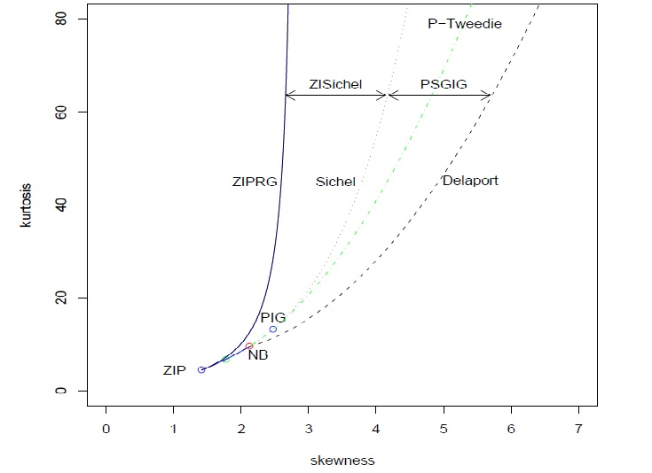

```{r setup, include=FALSE}
knitr::opts_chunk$set(echo = TRUE, fig.path="imgs/")
library(tidyverse)
library(gamlss)
```

# Uogólnione modele addytywne z parametrami położenia skali i kształtu - GAMLSS

## Heteroskedastyczność w modelu liniowym

Po raz kolejny wróćmy do modelu regresji liniowej. Wyobraźmy sobie, że badamy zależność między wiekiem, a ciśnieniem krwi. Nasz model w przypadku regresji liniowej wygląda więc następująco:

$$
DIA|AGE \sim N(\mu, \sigma^2)\\
\mu = \beta_0 + \beta_1 AGE
$$
gdzie $DIA$ oznacza ciśnienie rozkurczowe, a $AGE$ oznacza wiek pacjenta.

```{r, message=FALSE, warning=FALSE}
blood <- read_csv2("blood.csv")
ggplot(blood, aes(age, diast)) + theme_bw() + geom_point() +
  xlab("WIEK") + ylab("CIŚNIENIE ROZKURCZOWE") +
  stat_smooth(method = "lm", se = TRUE)
```

Na powyższym rysunku widać dopasowanie modelem regresji liniowej. Na pierwszy rzut oka widać, że zależność między wiekiem, a ciśnieniem jest liniowa co może świadczć o słuszności wyboru modelu liniowego. Na wykresie wiedać jednak też, że poza średnią wartością ciśnienia wraz z wiekiem zmienia się również jego wariancja, czyli mamy do czynienia z **heteroskedastycznością**. Jednym ze standardowych rozwiązań tego problemu jest zmiana metody najmniejszych kwadratów (OLS) na **ważoną metodę najmniejszych kwadratów** (WLS). 

Zastanówmy się jednak nad nieco innym podejściem. Zamiast wyliczać wagi w modelu WLS mozemy do naszego modelu dodać kolejne równanie i spróbować zamodelować wariancję tak samo jak wartość oczekiwaną:

$$
DIA|AGE \sim N(\mu, \sigma^2)\\
\mu = \beta_{01} + \beta_{11} AGE\\
\sigma = \beta_{02} + \beta_{12} AGE
$$

Dzięki takiemu podejściu będziemy w stanie powiedzieć jak zmienia się nie tylko średnia, ale takze odchylenie standardowe, w metodzie WLS nie mamy takiej możliwości.

W tym miejscu warto sobie zadać pytanie. Skoro rozpatrujemy model, w którym modelujemy średnią iodchylenie standardowe to moze warto zastanowić się nad modelowaniem innych parametrów takich jak **kurtoza** i **skośność** ? Oczywiście w powyzszym modelu zakładamy, ze zmienna pochodzi z rozkładu normalnego, którego kurtoza i skośność są równe $0$, co oznacza, że w tym przypadku nie możemy ich zamodelować. Istnieje jednak wiele rozkładów (wychodzących poza rodzinę rozkładów wykładniczych), których parametryzacja zależy nie tylko od od średniej i dchylenia standardowego, ale także od skośności czy kurtozy.

Ponizszy rysunek przedstawia wartości kurtozy i skośnosci dla różnych rozkładów przy stałej wartości oczekiwanej i wariancji równej odpowiedni $1$ i $2$.



Z rozkładami o zmiennych parametrach skośności i spłaszczenia mozna się spotkac np. badając zagadnienia z zakresu genetyki, ubezpieczeń, medycyny czy finansów.

## GAMLSS

**Uogólnione modele addytywne z parametrami położenia skali i kształtu - GAMLSS** (Genaralized additive models for location, scale and shape) to klasa semiparametrycznych modeli regresji/klasyfikacji będących rozszerzeniem modeli GLM oraz GAM. GAMLSS pozwala na modelowanie średniej, odchylenia standardowego, kurtozy i skośności, a ogólna postać modelu wygląda natępująco:

$$
\left\{\begin{array}{l}
y|X \sim G A M L S S(\mu, \sigma, \tau, v) \\
g_1(\mu)=\eta_{1}=X_{1} \beta_{1}+\sum_{j=1}^{J_{1}} Z_{j 1} \gamma_{j 1} \\
g_2(\sigma)=\eta_{2}=X_{2} \beta_{2}+\sum_{j=1}^{J_{2}} Z_{j 2} \gamma_{j 2} \\
g_3(\tau)=\eta_{3}=X_{3} \beta_{3}+\sum_{j=1}^{J_{3}} Z_{j 3} \gamma_{j 3} \\
g_4(v)=\eta_{4}=X_{4} \beta_{4}+\sum_{j=1}^{J_{4}} Z_{j 4} \gamma_{j 4}
\end{array}\right.
$$

gdzie $\beta_k=(\beta_{1k}, .., \beta_{p_kk})$ jest wektorem parametrów długości $p_k$, $X_k$ jest znana macierza predyktorów (efektów stałych), rzędu $n\times p_k$, $Z_{jk}$ jest znaną macierzą efektów losowych rzędu $n\times q_{jk}$, $\gamma_{jk}$ to wektory efektów losowych długości $q_{jk}$. Wektory te z założenia maja rozkład normalny $\gamma_{jk} \sim N_{jk}(0, G_{jk}^{-1})$, gdzie $G_{jk}^{-1}$ jest odwracalną symetryczną macierzą $G_{jk} = G_{jk}(\lambda_{jk})$, która moze zalezeć od wektora hiperparametrów $\lambda_{jk}$.

Każdy parametr rozkładu moze być modelowany z użyciem różnych predyktorów i przy uzyciu wszelkich nieliniowych estymatorów (slpajny, falki, loess, itp. itd.) oraz efektów losowych. W szczególnym przypadku gdy $Z_{jk}$ jest macierzą identycznościową, a $\lambda_{jk} = h_{jk}(x_{jk})$ otrzymujemy semi-parametryczna addytywna formę GAMLSS:

$$
g_{k}\left(\theta_{k}\right)=\eta_{k}=X_{k} \beta_{k}+\sum_{j=1}^{J_{k}} h_{j k}\left(x_{j k}\right)
$$

gdzie $k = 1,...,4$, a $h_{jk}$ są pewnymi funkcjami wygładzanymi. Podobnie jak w przypadku GAM estymacja polega na minimalizacji penalizowanego log-likelihood:

$$
\ell_{p}(\beta, \gamma)=\ell(\beta, \gamma)-\frac{1}{2} \sum_{k=1}^{p} \sum_{j=1}^{J_{k}} \lambda_{j k} \gamma_{j k}^{T} G_{j k} \gamma_{j k}
$$

## Rozkłady dostepne w GAMLSS

W przypadku modeli GLM oraz GAM rozkład zmiennej zaleznej musiał nalezeć do rodziny rozkładów wykładniczych. W modelach GAMLSS założenie to zostało poluzowane i rozkład ten może być praktycznie dowolnych rozkładem parametryzowalnym. Potocznie mówi się o rodzinie rozkładów GAMLSS do której nalezy około 70 rozkładów, wśród których znajdują się rozkłady ekstremalnie skośne lub spłaszczone. Wspaniałą cechą wspomnianej rodziny jest to, że bazując na rozkładach należących do GAMLSS w prosty sposób mozemy tworzyć nowe. Istnieje kilka sposbów na powiększenie rodziny GAMLSS:

- stworzenie **rozkładu uciętego** (truncated distribution) z rozkładu należącego do GAMLSS
- stworzenie **rozkładu ocenzurowanego** (censored distribution) z rozkładu należącego do GAMLSS
- stworzenie **rozkładu zdyskretyzowanego** (discretized distribution) z rozkładu należącego do GAMLSS
- stworzenie **mieszaniny rozkładów** (mixture distribution) z rozkładu należącego do GAMLSS

W tym miejscu nalezałoby wyjasnić powyższe pojęcia. Wyobraźmy sobie, że przeprowadzamy badanie w laboratorium. Używając "idealnego" (w tym sensie, że otrzymaliśmy każdy pomiar) detektora uzyskaliśmy nastepujące wyniki:

$$
{1, 1.25, 2, 3, 5, 7, 12}
$$
W rzeczywistych warunkach "idealny" detektor jednak nie istnieje. Każda maszyna ma swoją **czułość** czyli taką wartość, dla której pomiar nie zostanie wykryty lub poprawnie zmierzony. Wyobraźmy sobie więc nieco bardziej realistyczny scenariusz. Czułość naszego detektora jest równa $1.5$, co oznacza, że wartości mniejszeod tego progu nie zostana wykryte przez nasz detektor. Uzyskamy więc wyniki:

$$
{2, 3, 5, 7, 12}
$$
Dwie pierwsze wartości nie zostały wychwycone przez nasz detektor i nia mamy pojęcia o ich istnieniu. Obserwacje te nazywane są **obserwacjami ucietymi**. Analogicznie nasz detektor mógłby równiez mieć górny próg detekcji równy np. $10$ wtedy wykrywalibyśmy tylko wartości z przedziału $[1.5, 10]$. Mówiac formalniej w laboratorium mierzymy pomiar zmiennej losowej $X$ z gestością $f_X(x)$, której nośnik równy jest pewnemu przedziałowi $[\alpha, \beta]$ (może to byc oczywiście cała prosta lub półprosta). Niestety pomiar ten mozemy zarejestrować tylko dla pewnych wartości. mamy więc do czynienia ze zmienną uciętą $X_a^b$ o gęstości:

$$
f_{X_{a}^{b}}(x)=\frac{f_{X}(x) \mathbf{l}_{[a, b]}}{F_{X}(b)-F_{X}(a)}=\operatorname{Tr}(x)\\
[a,b] \in [\alpha, \beta]
$$

gdzie $F_X(x)$ oznacza dystrybuantę zmiennej losowej $X$.

Rozważmy teraz analogiczną sytuację, z jedną drobną różnicą. Niech nasz detektor ma te same progi co poprzednio, jak poprzenio nie będziemy w stanie zmierzyc pomiarów mniejszych od $1.5$ i większych od $10$ jednakże tym razem otrzymamy informację o tym, że pojawił się pomiar wykraczający poza czułość maszyny. Uzyskamy więc wartości:

$$
{1.5<, 1.5<, 2, 3, 5, 7, 10>}
$$
Tym razem mamy do czyenienia z **obserwacjami cenzurowanymi**, ponieważ otrzymaliśmy informację o dokonaniu pomiaru, jednakże nie możemy podać jego dokładnej wartości. Tym razem nie będziemy rozpatrywać zmiennej ucietej $X_a^b$, a zmienną $X$. Cenzurowanie obserwacji należy jdnak uwzględnić w procesie estymacji, dlatego też likelihood zmiennej $X$:

$$
\mathscr{L}(\theta)=\prod_{i=1}^{n}(f_{X}(x_{i} \mid \theta))
$$

zostaje zastąpione poprzez:

$$
\mathscr{L}(\theta)=\prod_{i=1}^{n}f_{X}(x_{i} \mid \theta)\left(F_{X}\left(b_{i} \mid \theta\right)-F_{X}\left(a_{i} \mid \theta\right)\right)
$$
Z **dyskretyzacja zmiennej** mozemy mieć do czynienia np. w zagadnieniach teorii niezawodności lub ubezpieczeń. Badając liczbę szkód lub awarii spodziewamy się raczej, ze wyniki powinny być liczbami całkowitymi. Często zdarza się, że zaobserwowana ciągła zmienna zostaje zastąpiona jej zdyskretyzowana wersją.

Ostatnią metodą tworzenia nowych rozkładów w GAMLSS jest stworzenie **mieszaniny rozkładów**. Rozważmy prosty przykład studenta za egzaminie ze statystyki. Profesor za zadanie wybiera estymację parametrów rozkładu Bernulliego. Wyciaga z kieszeni dwie (być może fałszywe) monety. Nastepnie wybiera jedna monetę nie pokazując studentowi, którą i rzuca $10$ razy. Powtarza tę procedurę $5$ razy, a spisane wyniki podaje studentowi. Dane, które otrzymał pochodzą z mieszaniny rozkładów dwumianowych:

$$
y \sim \pi \text { Binominal }\left(p_{1}, 10\right)+(1-\pi) \text { Binominal }\left(p_{2}, 10\right)
$$

Zadaniem studenta jest oszacowanie wartości $p_1$ i $p_2$. Problem w tym, że student nie mógł zaobserwować, który rzut odpowiada której monecie. Mamy tu do czynienia z tak zwaną **zmienną latentną** $\pi$, czyli zmienna nieobserwowalną. Zmienna ta odpowiada za wybór między monetami. Pytanie brzmi jak w tych warunkach wyestymować powyższe parametry ? Zadanie tego typu to problem, w którym "musimy najpierw znaleźć A, by móc znaleźć B, a jednocześnie musimy najpierw znaleźć B, by móc znaleźć A". Niech wyniki kolejnych rzutów będą dane następująco:

$$
{(5O, 5R), (9O, 1R), (8O, 2R), (4O, 6R), (7O, 3R)}
$$
Rozwiązanie znajdziemy iteracyjnie, postępując w nastepujący sposób:

1. W pierwszym kroku ustalmy pewne wartości początkowe dla estymowanych parametrów:

$$
\hat{p}_1^{(0)}=0.6\\
\hat{p}_2^{(0)}=0.5
$$

2. Ponieważ nie wiemy z jakiej monety pochodziły kolejne serie rzutów obliczamy wartości likelihood każdej serii dla obu monet. dla przykładu w pierwszej serii mieliśmy $5$ orłów i $5$ reszek:

$$
\ell_{1}=\left(\hat{p}_{1}^{(0)}\right)^{5}\left(1-\hat{p}_{1}^{(0)}\right)^{5}=0.6^{5} 0.4^{5}=0.0007962624
$$
i dla monety drugiej

$$
\ell_{2}=\left(\hat{p}_{2}^{(0)}\right)^{5}\left(1-\hat{p}_{2}^{(0)}\right)^{5}=0.5^{5} 0.5^{5}=0.0009765625
$$
Następnie wyniki normalizujemy tworząc wagi:

$$
w_{1}=\frac{0.0007962624}{0.0007962624+0.0009765625}=0.45=1-w_{2}
$$
Powtarzamy dla każdej serii rzutów.

3. Otrzymane wagi mnożymy przez wyniki rzutów w serii tworząc przewidywania dla obu monet. Dla przykładu w pierwszej serii otrzymaliśmy wagi $0.45$ i $0.55$. wynika z tego, ze nowe rzewidywania dla monety pierwszej wynoszą $0.45 ∗ (5O, 5R) = (2.2O, 2.2R)$, a dla drugiej $0.55 ∗ (5O, 5R) = (2.8O, 2.8R)$.

Wyniki dla wszystkich serii wynsza:

$$
\begin{array}{|l|l|l|l|}
\hline w_{1} & w_{2} & \text { Moneta l } & \text { Moneta } 2 \\
\hline 0.45 & 0.55 & 2.20,2.2 \mathrm{R} & 2.8 \mathrm{O}, 2.8 \mathrm{R} \\
0.8 & 0.2 & 7.2 \mathrm{O}, 0.8 \mathrm{R} & 1.8 \mathrm{O}, 0.2 \mathrm{R} \\
0.73 & 0.27 & 5.9 \mathrm{O}, 1.5 \mathrm{R} & 2.1 \mathrm{O}, 0.5 \mathrm{R} \\
0.35 & 0.65 & 1.4 \mathrm{O}, 2.1 \mathrm{R} & 2.6 \mathrm{O}, 3.9 \mathrm{R} \\
0.65 & 0.35 & 4.5 \mathrm{O}, 1.9 \mathrm{R} & 2.5 \mathrm{O}, 1.1 \mathrm{R} \\
\hline
\end{array}
$$
Sumując wyniki ze wszytskich serii otrzymujemy $21.3$ orłów i $8.6$ reszek dla pierwszej monety oraz $11.7$ orłów oraz $8.4$ reszki dla drugiej monety. Nastepnie aktualizujemy parametry modelu:

$$
\begin{array}{l}
\hat{p}_{1}^{(1)}=\frac{21.3}{21.3+8.6}=0.71 \\
\hat{p}_{2}^{(1)}=\frac{11.7}{11.7+8.4}=0.58
\end{array}
$$

5. Kroki 2-4 powtarzamy tak długo, aż wartości $p_i^{(k)}$ przestaną się zmieniać. W naszym przykładzie otrzymamy wartości $0.8$ i $0.52$.

Powyższa procedura opisuje działanie **algorytmu E-M** (expectation-maximization), który traktować można jako generalizację metody największej wiarygodności dla modeli ze zmienna latentną. algorytm składa się z dwóch kroków. W kroku E tworzone jest oczekiwane log-likelihood na podstawie obecnych estymacji (w przykładzie punkt2.). w kroku M wyliczane są nowe wartości estymatorów (w przykładzie punkty 3.-4.). Nastepnie z nowymi estymacjami wracamy do kroku E. 

```{r}
set.seed(1234)
p1 <- 0.55
p2 <- 0.73
pii <- 0.43
size <- 100
rounds <- 50
generate_flips <- function(p1, p2, pii, size, rounds) {
  1:rounds %>% map(~ {
    selected_coin <- if(runif(1) < pii) p1 else p2
    sample(0:1, size, TRUE, prob = c(1 - selected_coin, selected_coin))
  })
}
data <- generate_flips(p1, p2, pii, size, rounds)
p1_hat <- 0.8
p2_hat <- 0.15
em_coins <- function(data, p1_hat, p2_hat, iter = 10) {
  coins_sum <- data %>% map_dbl(~ sum(.))
  results <- tibble(
    iteration = 0,
    p1_hat = p1_hat,
    p2_hat = p2_hat
  )
  for (i in 1:iter) {
    likelihood <- list(p1_hat, p2_hat) %>% map(~ {
      p <- .x
      (1 - p)^(length(data[[1]]) - coins_sum) * p^coins_sum
    })
    weights <- likelihood[[1]] / (likelihood[[1]] + likelihood[[2]])
    w_count <- list(weights, 1 - weights) %>% map(~ {
      tails <- sum(.x * (length(data[[1]]) - coins_sum))
      heads <- sum(.x * coins_sum)
      c(tails, heads)
    })
    p1_hat <- w_count[[1]][2] / sum(w_count[[1]])
    p2_hat <- w_count[[2]][2] / sum(w_count[[2]])
    print(paste("New p1:", p1_hat, "New p2:", p2_hat))
    results <- results %>% add_row(iteration = i, p1_hat = p1_hat, p2_hat = p2_hat)
  }
  ggplot(results, aes(x = iteration)) + geom_line(aes(y = p1_hat), color = "red") +
    geom_line(aes(y = p2_hat), color = "blue") + theme_bw()
}
em_coins(data, p1_hat, p2_hat, 10)
```

