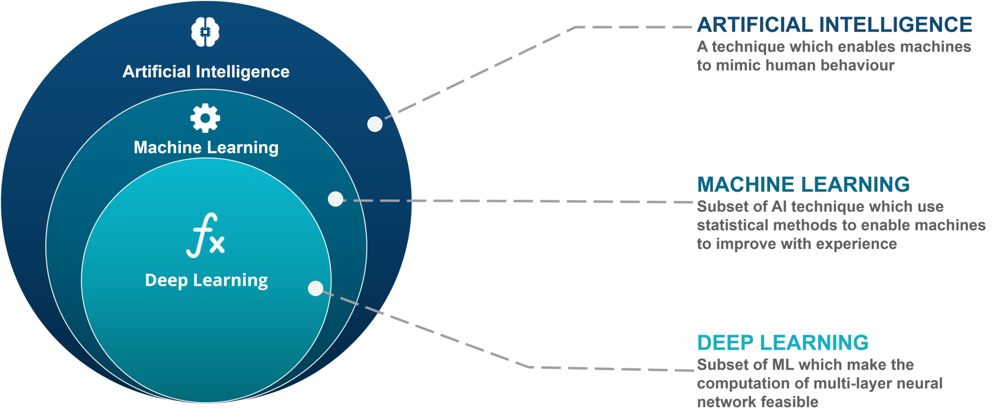
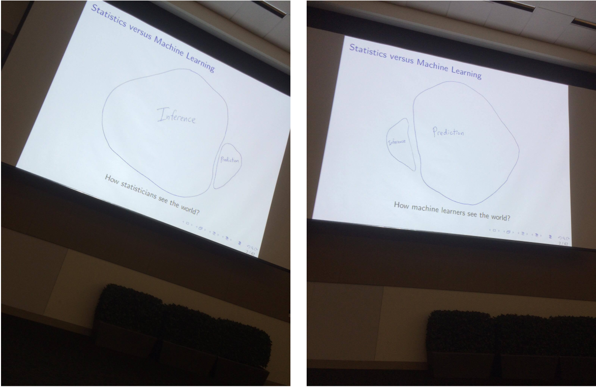
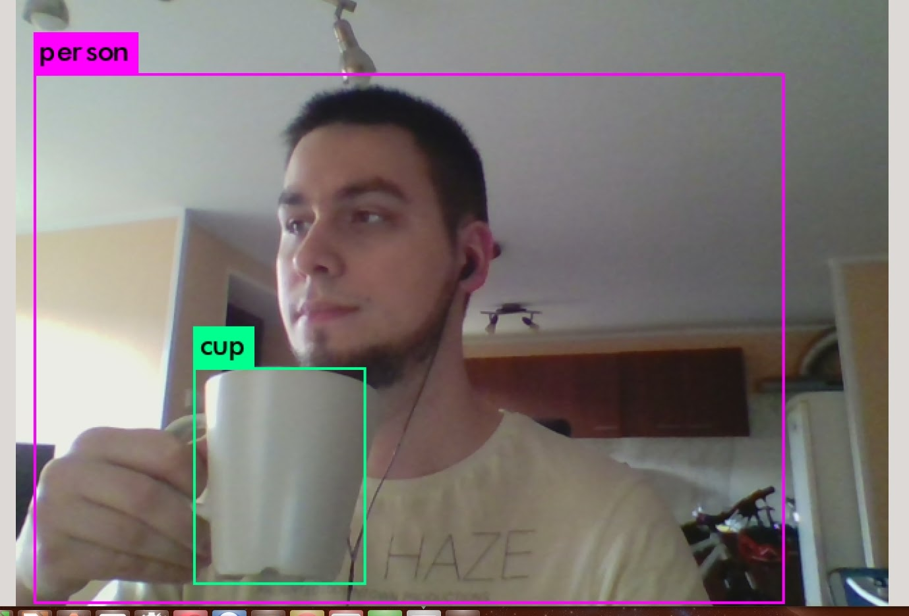

```{r setup, include=FALSE}
knitr::opts_chunk$set(echo = FALSE, fig.path="imgs/")
```

# Wstęp

## Machine Learning i Statystyka

**Uczeie maszynowe / Machine Learning (ML)** jest zbiorem metod/algorytmów, służących do automatycznego wykrywania wzorców w danych oraz do wykorzystywania odkrytych wzorców do przewidywania przyszłości (predykcji) lub podejmowania innych decyzji w warunkach niepewności. ML jest subdziedziną **Sztucznej Inteligencji / 
Artificial Intelligence (AI)** i bazuje na metodach znanych ze **Statystyki**.



Na temat różnić między Statystyką, a Machine Learningiem możnaby dywagować w nieskończoność (niepotrzebnie), jednakże najlepiej i najprościej ujął to profesor Robert Tibshirani, współautor [An Introduction to Statistical Learning: With Applications in R](https://www.ime.unicamp.br/~dias/Intoduction%20to%20Statistical%20Learning.pdf):



## Typy/zadania Uczenia Maszynowego

Uczenie maszynowe z reguły dzielone jest na 3 podstawowe podkategorie:

### Uczenie nadzorowane (supervised learning)

W ramach uczenia nadzorowanego naszym zadaniem jest znalezienie pewnego **"optymalnego mapowania"** ze **zmiennych objaśniających** $X$ do **zmiennych objaśnianych** $Y$ mając do dyspozyjcji **zbiór treningowy** 
$\mathcal{D}=\left\{\left(\mathbf{x}_{i}, y_{i}\right)\right\}_{i=1}^{N}$, zawierający realizację owych zmiennych, gdzie $N$ oznacza liczbę obserwacji z wbiorze treningowym. W najprostszym przypadku $\mathbf{x}_{i}$ jest $D$-wymiarowym wektorem numerycznym $\mathbf{x}_{i} \in \mathbb{R}^D$, choć w rzeczywistości może on posiadać bardziej złożoną strukturę, może on np. reprezentować obraz, dźwięk, tekst, szereg czasowy itp. Podobnie postać $y_{i}$ może być dowolna, jednakże w większości przypadków zakładac będziemy, że $y_{i}$ zmienną kategoryczną i przyjmuje wartości z pewnego skończonego zbioru $y_{i} \in \{1, ..., C\}$ lub jest skalarem $y_{i} \in \mathbb{R}$

Gdy $y_{i}$ jest zmienną kategoryczną mówimy, że mamy do czynienia z **klasyfikacjią** (lub **rozpoznawaniem wzorców**), jeśli $y_{i}$ jest skalarem mówimy, że mamy do czynienia z **regresją**.

Z probabilistycznego punktu widzenia zainteresowani jesteśmy rozkładem warunkowym $p(y_{i} | \mathbf{x}_{i}, \mathbf{\theta})$, gdzie $\mathbf{\theta}$ jest wektorem parametrów modelu.

Przykłady:

1. Predykcja cen mieszkań. Na podstawie zestawu zmiennych numerycznych i kategorycznych zawierających informacje o mieszkaniu chcielibyśmy przewidzieć jego cenę.

```{r}
library(mlbench)
data("BostonHousing")
head(BostonHousing)
```

2. Diagnostyka raka piersi. Na podstawie zestawu zmiennych numerycznych i kategorycznych zawierających informacje o pacjencie chielibyśmy dowiedzieć się czy typ raka jest łagodny czy złośliwy.

```{r}
data("BreastCancer")
head(BreastCancer)
```

3. Detekcja SPAM. Na podstawie zawartości e-maili chcielibyśmy zaklasyfikować wiadomość jako SPAM bądź prawidłową korespondencję.

```{r}
library(kernlab)
data(spam)
head(spam)
```

4. Detekcja obiektów. Na podstawie obrazów chcielibyśmy zakwalifikować obiekty znajdujące się na nich, a także wskazać ich konkretne położenie. Jest to połączenie klasyfikacji i regresji.



5. Segmentacja obrazu. Na podstawie obrazów chcielibyśmy zaklasyfikowac każdy pixel znajdujący się na nich.


### Uczenie nienadzorowane (unsupervised learning)

W przeciwieństwie do uczenia nadzorowanego, w uczeniu nienzdzorowanym dysponujemy tylko inputem $\mathcal{D}=\left\{\mathbf{x}_{i}\right\}_{i=1}^{N}$, a naszym celem jest odnalezienie "interesujących wzorców". Zadania tego typu są zazwyczaj trudniejsze do poprawnego zdefiniowania, ponieważ nie od razu wiemy czym są "interesujące wzorce" oraz jak poprawnie określić metrykę błędu (w przeciwieństwie do uczenia nadzorowanego, gdzie mamy mozliwość porównania prawdziwej odpowiedzi $y_{i}$ z predykcją $\hat{y}_{i}$).

W przypadku uczenia z nadzorem zainteresowani byliśmy rozkładem warunkowym $p(y_{i} | \mathbf{x}_{i}, \mathbf{\theta})$, w uczeniu nienadzorowanym budować będziemy modele w oparciu o rozkład $p(\mathbf{x}_{i} | \mathbf{\theta})$. 

Przykłady:

1. Klasteryzacja (clustering) klientów banku (lub sklepu). 

### Uczenie ze wzmocnieniem (reinforcement learning)

W przypadku uczenia ze wzmocnieniem nie dysponujemy zbiorem treningowym w żadnej postaci. Zamiast tego inteligentny agent uczy się jakie akcje powinien podejmować w danym środowisku, aby zmaksymalizować nagrodę. Proces uczenia odbywa się (często w czasie rzeczywistym) poprzez podejmowanie przez agenta kolejnych prób w wyniku czego zostaje on nagrodzony bądź ukarany.

